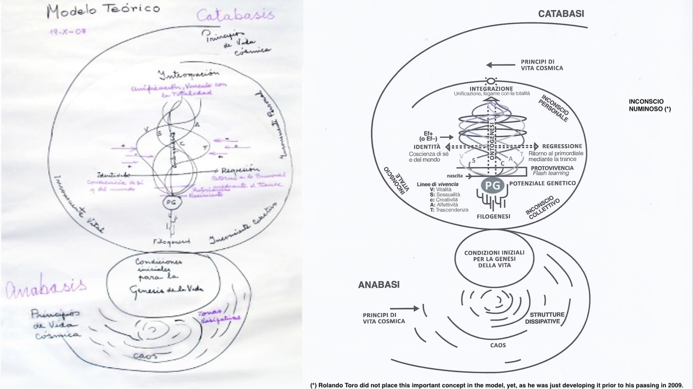

# Introduction {#intro}

My Biodanza journey started in 2018.  Fien, my wife, took up the Biodanza teacher training and together we joined a weekly Biodanza group in Brugge. We quickly experienced the positive impact of our Biodanza practice on our lifes. 

Two years later, true Biodanza magic happened.
In January 2019 our eldest son had a bike accident, from which he recovered well. 
However, it transformed our coupledom temporarily into a relationship of caring. In 2020, we realised that the events deepend our bound tremendously, however, at the cost of passion and attraction. Indeed, caring for each other implied us to alternate in strength to provide containment for the other, which drove us emotionally out of sync. Regardless of our efforts and mentally knowing what had to happen, it was difficult to get our feelings realigned. 

Annette's Biodanza Summer Retreat in 2020 in the French Ardennes, was where the magic happened.  The retreat started with an integrating vivencia (Biodanza session). The key exercise of the vivencia was the encounter. As soon as our eyes touched, I could see Fiens' emotions in her gaze and I knew that she felt the same. It happened in an instant, here and now, and ever since we have regained our emotional resonance. So this immense powerful vivencia did what all our mental work and struggle in 2020 could not accomplish. 

How can Biodanza be so tranformative? 
It uses the power of music and movement in an affective group to evoke vivencia, a deep experience with a strong bodily component. Vivencia happens here and now, and precedes our mental consciousness. It can triggers positive processes of change that continue well beyond Biodanza sessions and work through in our daily life.  

```{r rolandoToro, fig.cap='Rolando Toro, the developer of Biodanza', echo=FALSE,out.width="45%",fig.align='center'}
#,out.extra='style="float:left; padding:10px"'}
knitr::include_graphics("./figs/rolando.jpeg")
```

For Rolando Toro, the inventor and developer of Biodanza, the most important thing was: “Vivencia, Vivencia, Vivencia”. Indeed, experiencing life through dance, music and movement enables us to deeply connect with our inner self, each other and the whole. Biodanza lets us feel that life is one and this through a deep and intense bodily experience. 

With his system of Biodanza Rolando anticipated against the degeneration of humanity and the human society he observed during the second world war. For Rolando it was clear that modern human beings suffer from a disease he called "society". Our current society brings us far from our natural state of being, feeling, affection and sympathy, which can trigger anyone to extreme acts of violence and cruelty. 

Therefore, he has developed his system of Biodanza from a nostalgia to love. A system that disseminates love and hope. A system that enables an affective re-education and that invites us to take part in a new way of live nourished by intense experiences.

Rolando was a passionate scientist and professor in psychology. He developed Biodanza from his own experiences and realized early on that his system has a strong foundation in the life sciences. During his development, he has also been inspired by the founders of modern dance and by primal people who still lay a deep meaning in each movement. 

By rediscovering meaning in each of our movements, we "re-humanize" and can find how to truly live life deeply connected with the beauty of nature surrounding us. 

```{r rolandoModel, fig.cap='Rolando Toro explaining his Model of Biodanza', echo=FALSE,out.width="45%",fig.align='center'}
#,out.extra='style="float:left; padding:10px"'}
knitr::include_graphics("./figs/rolandoAndModel.jpeg")
```


Rolando has laid the foundation of his system during his career as a psychologist/researcher where he discovered the true impact of exercises that stimulate biological regression and identity, the first axis in his system. As opposed to the conventional mode of action in psychiatry, which has a starting point that is in essence symptomatic, for instance by dosing hormones or neurotransmitters that a patient is lacking, Rolando developed the vision that external stimuli (ecofactors) such as music, movement, touch, caressing, encounters and dance can induce us to rebalance ourselves. And this effectively stimulates us to tap into our genetic potential, which can promote immense growth and renewal both at a physiological and psycho-emotional level.

Growth and learning in Biodanza happens as how children learn: by seeing, imitating, experiencing and repetition, and, this deeply embedded in a enriched environment with positive reinforcement. 

In this remainder of this chapter we will lay the foundation that is needed before delving into the biological aspects of Biodanza.  We begin with the definition of Biodanza. We continue with the Biocentric Principle. We then introduce the model of Biodanza and we conclude with the aims of this monograph. 

## Definition of Biodanza

Rolando coined the term "Biodanza", which is a contraction of "bios", the Greek word for "life", and, "danza" the Spanish word for dance. Here, the word "danza" is used in its original sense of "natural movement" that is full of meaning and well-connected with our emotions.

<!-- Marcelo Mur defines Biodanza in its most simple form as a system of moderate movement and stimulation of sociability. -->
Rolando Toro defined Biodanza as a poetry of encounter. Indeed, all exercises can be seen as a preparation on the encounter with oneself, each other and the whole.  

In Rolando's more academic definition Biodanza is a system of human integration, of organic renewal, of affective re-education and of re-learning the original functions of life. 

The methodology of Biodanza consists of inducing integrating vivencia through music, movement and encounters in an affective group.

In 2009 Rolando Toro combined this methodological aspect together with his observation that Biodanza accelerates integration in his updated definition: "Biodanza is a system that accelerates integrative processes at the cellular, immune, metabolic, neuro-endocrino and  existential level by providing an enriched environment including selected music, integrative movement, caress and group interactions."

### Vivencia 

The concept of vivencia is key to understand the method of Biodanza. 

Vivencia is an intense sensation of living, here and now, with a strong component of total organic sensation. <!-- that can elicits a strong awareness of our bodily existence. --> It is a manifestation of being that precedes mental consciousness. Vivencia are passing experiences, e.g. vivencia of fullness, of safety, of delight. The awareness of experiencing vivencia can come instantly or at a later moment and can give rise to deep emotions.

We do not have to try to rationalize our vivencia. They can been seen as manifestations of our bodily wisdom and spontaneously initiate integration and learning by experience. They are transformative experiences, which are the essence of the method of Biodanza. Indeed, our vivencia are key for growth and integration. Practicing Biodanza can also induce a sense of awakening when we notice that actual growth has taken place upon embodying our vivencia.


### Human Integration

Through vivencia a strong connection with life is established, which induces the integration with oneself, the human species and the universe.

The integration with oneself restores our psycho-physical unity, i.e. the unity of the internal/psychic and external/physical world.

Integration with our fellow humans restores the connection within our species as a biological unity.

Integration with the universe re-unites us with nature and restores our intimate relation with the entire biosphere. 
It lets us re-experience the deep connection of ourselves as part of the cosmos.

By restoring this connection to life, we can re-experience life to its very existence, here and now, which promotes growth and renewal on a biological, physiological and psycho-emotional level and can also be accompanied by a sense of a deep conscious awakening.

###  Organic Renewal

Biological systems possess the unique capacity of self-replication and self-organisation. However, stress, among others, can have a profound impact on cell and tissue maintenance and regeneration. 

With transcendent Biodanza exercises we slow down our movements, lower our state of control and evoke a deep state of rest. This state is essential to switch on restoration and regeneration, and, reinforces homeostasis, i.e. our bodies mechanism to maintain its equilibrium despite the changes in our environment.

### Affective Re-education 

In Biodanza many exercises stimulate and elicit affection and harmony, which can work through in our daily life by bringing harmony in our relation with ourselves, among each-other and with our environment. 

### Re-learning of the Original Functions of Life

Biodanza practice also reconnects us with our primal instincts, which are suppressed in our modern society and are often viewed as irrational behavior. 
However, our instincts can be viewed as the biological wisdom of our species, which evolved for survival and maintenance of our species. By reconnecting ourselves with our innate impulses, we also restores harmony from within.

### Enriched environment

Biodanza provides an enriched environment with a deep respect for the uniqueness of each individual, without judgement or comparison. An environment that stimulates growth and free expression of each participant in the group. The enrichment also originates from selected music, integrative movement, caress and group interactions that act as positive ecofactors. Another pivotal element is the structure and repetition that is provided by weekly Biodanza classes. Indeed, the weekly vivencia are progressive and transformative, and accelerate human integration at the physical, physiological, psychological, emotional, social and existential level. 

## Biocentric Principle {#sectionBiocentricPrinciple}

The Biocentric Principle is at the heart of Rolando Torro’s system of Biodanza. The biocentric principle considers the universe as the matrix of life, i.e. a self-organizing structure that is building life. So not only living organisms, but, rather the entire cosmos is viewed as a massive living hologram. 

This view invites people to radically rethink their relationship as a human being with the entire biosphere. Indeed, life itself becomes intrinsically sacred, which probes us to put all of life, and thus the entire universe, at the heart of our weltanschauung. 

To me, it seems an invitation to gravitate from anthropocentrism, with human beings at its center, back to the view of primal cultures where the environment we are living in is not seen as the stage upon which we tread, but as an entity with whom we can communicate and build a deep intimate relationship.

Vivencia is the unique path to experience the Biocentric Principle and to genuinely become aware of it. This through our embodied mind, that also connects to that deeper knowledge that lies hidden in our inner self, ready to be touched by the intimate vivencial experience.
  
## Model of Biodanza {#sectionModelOfBiodanza}

Rolando Toro developed a scheme of his model of Biodanza that summarizes its foundation in the life sciences and its methodology, which is displayed in Figure \@ref(fig:model).  


```{r model, fig.cap='Model of Biodanza (left: drawn by Rolando Toro in 2008, right: adapted from the AIPOB website)', out.width='100%', fig.asp=.8, fig.align='center', echo=FALSE}

```

In this section I will first briefly introduce the biological aspects in the model of Biodanza, which is the main theme of this monograph.  Next, I will briefly touch upon the methodology of Biodanza.

### Biological Aspects of Biodanza

In Figure \@ref(fig:model) we see that the biological aspects of Biodanza are forming the vertical axis, the skeleton, of the Model of Biodanza. Note, however, that these concepts also have an important sociological, psychological, emotional and mystic dimension as a very substantial part of our human life takes place in the symbolic social domain.

The vertical axis consists of

1. Principles of cosmic life and genesis of life 
2. Evolution and phylogenesis
3. Genetic potential and ontogenesis  

This vertical axis is driven by the symbiotic pair of anabasis/catabasis, or creation/destruction. Anabasis is the integration from chaos to self-organising systems, such as living creatures, whereas catabasis refers to the disintegration of such systems. The disintegration, however, immediately is the seed for novel creation. Indeed, life is inherently cyclic.

Our cosmos as we know it originated out of chaos. It started with a very energy-rich state. It quickly cooled down enough for energy to be converted into mass - the majority in hydrogen and a fraction in more heavy helium nuclei. Due to the gravitational force, matter then started to cluster in nebula and eventually formed stars. 

In the stars all elements have been formed by nuclear fusion and with each supernova, i.e. an explosion of a star at the end of its life, these elements/atoms are projected into space. 

In space these atoms further reacted and formed more complex molecules that eventually gave rise to precursors ("forerunners") of the biological building blocks of life. 

In a remote corner of our milky way, an average galaxy, on an average planet, Earth, there originated unique conditions that made the *genesis of life* possible. 
This was initiated by a chemical evolutionary process that gave rise to molecules with increasing complexity ultimately leading to chemistry that enabled self-replication and self-organisation and to the four essential bio-molecules of which all life is built: 

- Lipids that enable the formation of membranes that are separating the inside of the cell from the outer world, 
- Carbohydrates or sugars that are used as energy sink/resource and as a backbone of many bio-molecules,
- Proteins, the workhorses in our cells that facilitate the majority of chemical reactions in our cells, and
- Nucleic acids, DNA and RNA, that are used to store and use our genome, i.e. the set of genes, we inherited from our parents. 

Once the first living cells emerged, they started to evolve and through evolution, they gave rise to all other living beings. This process is also referred to as phylogenesis.

We, humans, are a leaf on a small branch of the tree of life. Each of us with our own genetic potential. Through the course of our life, we develop from a fertilized egg cell to an embryo, a child, up to a full grown adult until we eventually die. During this process, which is also referred to as ontogenesis, the way how we use our genes is changed. 

Indeed, at the conception we inherit the structure of our cells from our biological mothers' egg cell and our genome from our biological mother and father. At first this egg cell has access to all genes. But, as the cell divides into a clump of cells that starts to differentiate in different tissues, these more specialized cells have only access to a restricted set of genes that are essential for their function. This happens through small molecules that interact with our DNA and can switch genes on or off. 
The study of how our development, behavior, and environment can cause changes that affect the way our genes are used, is also referred to as epigenetics. 

Epigenetic changes are passed in cell division to the two new cells that are formed, which makes a liver cell to remain a liver cell and a brain cell to remain a brain cell upon cell division. 

Also, external stimuli and eco-factors can induce epigenetic changes and thus how we use our genetic potential.  
<!-- This is exactly what we aim for with the methodology of Biodanza, which lies at the heart of the model of Biodanza. -->

Note, that in its broader definition ontogenesis not only looks at the biological development of the species, but also at the biological development of the individual which also implies an important social, psychological and emotional component.
Indeed, it was exactly in this larger field that Rolando was operating. A field that lies at the interface of the life sciences, anthropology, psychology, physiology, art and mysticism, and from which he developed his system for growth and integration.  

### Methodology of Biodanza

Vivencia is the cornerstone of the method of Biodanza. It reconnects us with the essence of life, which can work through both at the psycho-socio-emotional and the physiological level. Indeed, when we experience a deep vivencia, this is accompanied by intense bodily experiences. So, a Biodanza session might induce physiological changes, and can trigger the production of hormones, neurotransmitters and proteins, which originate from the expression of specific genes in our body and brain. 

By integrating our vivencia and repeating exercises, Biodanza can promote human growth and evolution. Indeed, people who practice Biodanza for a longer period also experience that it can have a deep impact on their life and their social interactions. Note, that this can also go hand in hand with changes at a  biological - physiological level. Indeed, ecofactors can induce epigenetic changes that activate or silence the expression of genes, and new neural connections can also emerge or can be promoted. So practicing Biodanza can affect the expression of our genetic potential. 

The methodology of Biodanza is the central part in the model of Biodanza see Figure \@ref(fig:model), which I view as the body that is added to the skeleton of life. 

#### Music, Movement and Vivencia 

Vivencia is evoked by means of music, movement and encounters in an affective group. 

Music is a universal language and is a very powerful source of transformation.  In Biodanza it has an essential function of evoking vivencia. Hence, the pieces of music used in Biodanza are very carefully chosen upon studying their emotional content, evaluating the organic effects they promote, and the type of vivencia they evoke; before they are added to the Biodanza repertoire [@toro2008].

Movement is another universal language that can be transformative, and, also plays a key function in evoking vivencia. Hence, movements are also very carefully chosen in Biodanza exercises. They stem from natural movements of human beings, gestures used in 'socializing rituals', such as giving hands, embracing, caressing, etc.; and  archetypical gestures, which we also find back in art of all human cultures and traditions. The movements can be executed by anyone. However, their sophistication comes from the meaning, emotion and feeling that is laid in it by the participant, which are of key importance for the depth of the vivencia [@toro2008].

So music, movement and vivencia form a gestalt. A tiny change to one component can radically alter the vivencial experience that emerges. 
With the delicate choice of the sequence of Biodanza exercises, the sequence of vivencia, an overarching vivencia unfolds for the entire session. 

Biodanza cannot be practiced in isolation. The encounter with each other is an essential component of movement and for generating a field that accommodates integration of oneself, with our human species and the whole.

#### Horizontal Axis: Identity and Biological Regression

Rolando has laid the foundation of his system during his career as a psychologist/researcher where he discovered the true impact of exercises that stimulate identity and biological regression, the horizontal axis in his system. 

A Biodanza session typically starts with vital rhythmic exercises that make participants aware of their body and their identity.
Then we make the bridge to more deepening exercises where we slow down our movements to lower our state of control. This can evoke a deep state of rest, dissolution of our ego, transcendence and integration. Indeed a state of biological regression that is harmonious and progressive, which reactivates important physiological patterns and brings us in contact with our origin and our potential to rebalance ourselves, among others. In Biodanza regression always refers to this important state of biological regression.


#### Vertical Axis: Five Lines of Biodanza

Rolando structured our genetic potential in five lines: Vitality, Sexuality, Creativity, Affectivity and Transcendence. They are his translation of the biological concept of genetic potential towards a broader biological and socio-psycho-emotional realm in which human growth and development takes place. 
In a Biodanza session we typically work in two or more of these lines.

In the model the five lines are spiraling around the vertical axis of ontogenesis. Indeed, weekly Biodanza sessions provide the ecofactors that induce growth in these five lines and that can have long-lasting effects on a genomic, physiological and psycho-socio-emotional level. 

We already get exposed to these five lines very early on in our lives, which Rolando referred to as protovivicencia. Indeed, protovivencia are the experiences of a newborn in response to  internal and external stimuli, e.g. through attention, food, love, care, caressing among others. 

The protovivencia go hand in hand with flash learning, the very rapid learning that happens in the first six months of a newborn. These protovivencia can also be structured according to the five lines of Biodanza. As Rolando described in his book Biodanza [@toro2008], the protovivencia of vitality stem from movement, action and rest; the protovivencia of sexuality is induced by contact and caresses; that of creativity by expression and curiosity; that of affectivity by nourishment and protection; and that of transcendence by the harmony a child experiences with their environment and surroundings.

During a Biodanza session we let (a subset of) the five lines pulsate by a sequence of exercises that first strengthen our identity and then induce biological regression. 
Exercises that strengthen identity let practitioners become more aware of themselves, the world around them and how they stand in that world. Exercises that stimulate biological regression on the other hand stimulates the ego to dissolve and promote a connection with our different levels of unconsciousness.

#### Unconsciousness 

In the periphery of methodology of Biodanza in the Model (Figure \@ref(fig:model)), we find the personal unconsciousness, collective unconsciousness and vital unconsciousness.
Which is a resonance with ideas and information on ourselves, our primal instincts and archetypes, and the information that pulsates in the matrix of life, respectively. 

Indeed, when a father caresses his baby, he connects with his personal unconsciousness through the bound he experiences with his child, with the Demeter or mother archetype in his collective unconsciousness, and, with his vital unconsciousness through the physiological response he experiences through the proteins, hormones and neurotransmitters that are expressed in his cells. 

So many of our actions are steered by our unconsciousness. 
Through Biodanza exercises aiming for biological regression and transcendence we can deeply connect with these three types of unconsciousness.  

At the end of his life, Rolando Toro, introduced a fourth unconsciousness, a deeper unconsciousness, a primordial unconsciousness that makes us human, an unconsciousness of human greatness: the numinous unconscious. It is according to Rolando the most repressed unconsciousness, repressed by our culture and its fatal dissociations that make us smaller and insignificant [@toro2009].

The numinous unconsciousness consists of four key characteristics: love, enlightenment, courage and intasy. Indeed, the need to love is intrinsic to our organism. Love implies communion, empathy, tenderness and mercy.  It can be undifferentiated, love for humanity, and differentiated, love for a particular person or group. It can even reach a cosmic level, i.e. epiphanic love, in which our heart, enters into communion with the heart of the other. The second characteristic is enlightenment, not as that from a guru, but as a process towards the other. It is the ability to see the best in each of us, to discover their essence and reveal their desire to live and be happy. The third characteristic is courage, the courage to know what we want without fear, to challenge our fear of living and loving. The courage to emerge from chaos when we are suffering or feel abandoned. The fourth characteristic is intasy, which refers to the splendor of our species, the splendor of being part of the universe, of the cosmos [@toro2009]. 
\newpage 

## Aims of this monograph

This monograph focuses on the Biological aspects of Biodanza. It is my impression on "Module II: Vital Unconsciousness and Biocentric Principle" and "Module IV: Biological Principles of Biodanza" of the Biodanza teacher training that I followed in the School of Antwerp.

In particular, I will try to place all concepts that appear in the official learning material of these two modules in the context of the Model of Biodanza. It is my humble attempt to provide more insight in these biological aspects for Biodanza teachers and enthusiasts who want to dive deeper into the scientific background of the System of Biodanza. 

This attempt consists of four parts: 

1. "What is Life", in which I lay a basic foundation and introduce important biological concepts that might provide a deeper insight in the concepts Biocentric Principle and Vital Unconciousness.
  
2. "Principles of Cosmic Life and the Genesis of Life", a short narrative on the history of the universe up to the origin of life.

3. "Evolution and Phylogenesis", which tells a brief story on the history of life and how life evolved.

4. "Ontogenesis", where I shed some light on how we evolve from our origin as a fertilized egg cell up to our adult stage until we eventually die. 

While the remainder of this monograph focuses on the Biological Aspects of Biodanza, it is important, however, to keep in mind that it is not my intention to reduce the Model of Biodanza to its biological aspects, only. Indeed, many of the concepts that we will touch upon from a biological perspective also have an important sociological, psychological, emotional and mystic dimension as a very substantial part of our human life takes place in the symbolic social domain.


