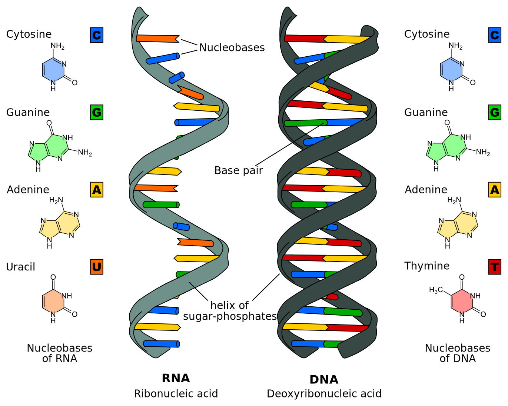
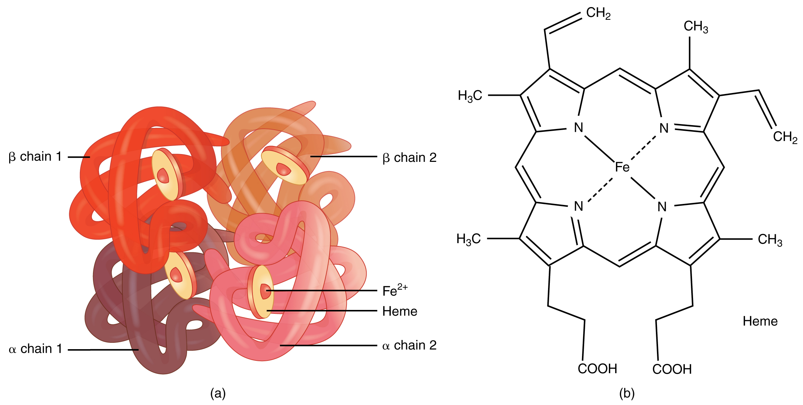

# What is Life?

This chapter is largely built on the work of five scientists who were very influential and who largely shaped Rolando Toro's views on the biological aspects that he incorporated in his Model for Biodanza: 

- Erwin Schrödinger who explicitly defined life as structuring "order-from-disorder", 
- Ilia Prigogine who developed the theory for this and coined the term "Dissipative structures",
- Christian de Duve one of the founding fathers of biochemistry and from whom Rolando borrowed the phrase that "Life is an obligatory manifestation of matter, written into the fabric of the universe", and 
- Humberto Maturana and Francisco Varela with their concept of autopoiesis,

on which we will elaborate in the sections below. I will also link them to two core concepts of Biodanza: the Biocentric Principle and Vital Unconsciousness.


## Schrödinger and Prigogine: a Thermodynamic View of Life

In his seminal lecture series: "What Is Life? The Physical Aspect of the Living Cell" @schrodinger1944  defined life as 

1. an open system that can generate order from chaos by exploiting external energy sources,

2. with the capacity to transmit its own specific blueprint from generation to generation.

Note, that in his seminal lecture series @schrodinger1944 also laid out key functions of the molecule that was involved in this specific blueprint and this while DNA was not even discovered.

At first, the property that life can generate order or structure seems to contradict the second law of thermodynamics that states that: a closed system is always gearing towards maximal entropy.

Entropy can be loosely defined as a physical quantity for the level of how energy is spread out. It is thus the tendency of a closed system to evolve from a concentrated energy state to an energy state that is more spread out. This can be easily explained with an example that is well known to anyone: if you put a hot pot in a large room, the pot will cool down and the temperature in the room will slightly rise until the pot and the room have the same temperature. As a result the concentrated heat energy from the pot is nicely spread out over the entire room. 

Schrödinger understood that life was not violating this second law. Indeed, by being an open system, it can interact with the environment, and by eating and breathing there has to be a way of “concentrating order" or maintaining a higher more concentrated energy state. 

Prigogine was the first to provide the theoretical framework for a type of chemistry that is key for life [@prigogineStengers1984]. He realized that the chemistry of life is totally different from most chemical systems that were studied up to then. Indeed, the chemistry and processes of life are highly non-linear with many feedback loops and are far from equilibrium.

We intuitively know the latter: a living system is typically at a higher energy state than the corresponding material in a non-living state. We can simply acknowledge that as we are hotter than the room, and a crude way to estimate how long we are death is by measuring the temperature of a corpse. To maintain our higher energy state we have to keep on eating and breathing in order to stay warm, to concentrate elements in our cells and to build ordered molecules with a high chemical energy content from it.  

Prigogine discovered that complex self-organizing systems can spontaneously arise if they are open and can exchange lots of energy and matter with their surroundings. 
Key for it is a chaos of matter and a flow of energy through the system.
In chemical systems, and life is to a large extend chemistry, the influx of energy allows the generation of structure while producing lots of entropy by dissipation. Indeed conversion of energy to heat inherently takes place in all underlying chemical reactions. Hence, a large part of the concentrated incoming energy is spread out in less concentrated energy in the form of heat. 
The structure that spontaneously emerges out of chaos is thus not violating the second law because of the rise in entropy by dissipation. 
Prigogine therefore coined the novel term dissipative structures for such systems. 

In the module of the Biodanza teacher training on the Biocentric Principle Rolando Toro often uses the term attractor.  Dissipative structures typically have multiple attractors, i.e. states, regimes, forms, shapes or structures to which they spontaneously evolve. The specific attractor to which the system is organizing itself highly depends on the initial environmental conditions. 
Note, that dissipative structures are also characterized by feedback loops. 
These feedback loops allow the system to remain at its current attractor.
However, some environmental stimuli are amplified by the feedback loops and can switch the dissipative structure towards another attractor and thus induce a regime switch. 

Prigogine argued that chemistry in cells, cells itself, tissues, organs, organisms, populations of organisms, ecosystems and our globe can be seen as dissipative structures [@prigogineStengers1984].
The fruiting body of slime molds are a compelling example of the change of the attractor of a system, see figure \@ref(fig:Dictyostelium). Dictyostelium slime molds, spend most of their lives as separate single-celled amoeba. But, upon stress one of the amoebas releases a chemical signal cAMP. Others detect this signal, and respond in two ways: the amoeba moves towards the signal and secretes more cAMP effectively boosting the signal. So the signal gets amplified by a feedback loop which eventually triggers the system to switch from their current attractor: a state of free living amoebas towards a novel attractor: their fruiting body (see e.g. you tube movie https://youtu.be/bkVhLJLG7ug).


```{r Dictyostelium, fig.cap='Stages of Dictyostelium lifecycle. (A - B) Dictyostelium cells chemotaxing toward cAMP released from a micropipette. Cells that have not yet sensed cAMP are shown in (A). Within 1 or 2 min the cells polarize and migrate toward the source of chemoattractant (B). (C - D) Scanning electron micrograph of streaming Dictyostelium cells (C) and the formation of aggregates (D). (E) Formation of aggregation centers on an agar plate. (F) Slugs moving on an agar plate. (G) Culmination stage. (H) Fruiting body. Figure from Müller-Taubergen et al. 2012', out.width='60%', fig.asp=.8, fig.align='center', echo=FALSE}
knitr::include_graphics("./figs/Dictyostelida.jpg")
```

</br> 
\newpage

In the module of the biocentric principle it is also mentioned that we live in a dissipative zone. Indeed, our whole globe can be seen as a large dissipative structure located in our solar system, which is a dissipative zone. 

1. There is an energy source, the sun that is radiating concentrated energy in photons.

2. Life organised structure from the chaos of molecules on Earth by dissipating energy from the solar photons, light and UV, to heat through their organic pigments, e.g. chlorophyll. 

3. Animals, bacteria and fungi are secondary dissipative structures that are feeding on the concentrated chemical energy in the form of sugar and starch that is produced by plants and cyanobacteria. They again dissipate energy in the form of heat through respiration. 

4. The heat produced by life is dissipated to water and air and this  induces tertiary dissipative processes like the water cycle, wind and sea currents etc. 

5. Eventually heat is radiated to space, which acts as an energy sink. 

Because the temperature of Earth remains roughly stable, the same amount of energy under the form of less concentrated heat is radiated to space as the amount of energy that is coming in through the more concentrated sunlight. However, the energy content of heat is lower and more disperse and thus has a higher entropy than that of the incoming sunlight.
Because almost no mass is exchanged between Earth and space, mass has to be recycled and life is cyclic. 

Prigogine showed that dissipative structures spontaneously emerge as soon as their is an energy source and sink, and thus an energy flow, and, a chaos of mass/chemicals available.
This is also what happened on earth. Our earth exists about 4.5 billion years and a soon as there was water on earth, life spontaneously emerged in less than 3 million years.  


## de Duve: a Biochemical View of Life

In his Book "Life Evolving - Molecules, Mind and Meaning", @deDuve2002 gave a very simple but brilliant definition of life: 

Life is 

1. One,
2. Chemistry, and 
3. Information 

In the following sections we will explore what de Duve meant with each component in his definition. 

### Life is One

#### All Living Organisms are Built of Cells

Life is one because all organisms are composed of cells. 
Green algae that can perform photosynthesis are a beautiful example of unicellular organisms. They were key for the development of life on our planet by releasing oxygen in our atmosphere (Figure \@ref(fig:greenAlgae)). 

```{r greenAlgae, fig.cap='Cyanobacteria, unicellullar organisms that can perform photosynthesis. They were key in the development of life and radically changed Earth by releasing oxygen to our atmosphere (Source: Chisholm Lab, Wikipedia)', out.width='30%', fig.asp=.8, fig.align='center', echo=FALSE}
knitr::include_graphics("./figs/Prochlorococcus_marinus.jpg")
```

A vital component of a cell is its membrane that is separating them from there environment, enables interaction with the environment and the concentration of chemicals inside the cell, among others.


Multicellular organisms are composed of multiple cells. The cells are organised in 

- tissues, e.g. spongy tissue in our bones or epithelium cells of our stomach, 
- organs, e.g. bones or our stomach,
- organ systems, e.g. skeleton or digestive system, etc.
- organism

Figure \@ref(fig:multiCellular) also shows how multicellular organisms are further organised in 

- populations of organisms
- ecosystems, and
- eventually our entire Biosphere

So life is one because all living organisms consist of cells, and as they are organised in large networks that work together at cellular, tissue, organ, organ systems, organism, population, ecosystem, up to the Biosphere level. 

```{r multiCellular, fig.cap='Multicellular organisms and biological organisation (Source: mrssmithsbiology)', out.width='30%', fig.asp=.8, fig.align='center', echo=FALSE}
#knitr::include_graphics("https://mrssmithsbiology.files.wordpress.com/2019/10/picture4.jpg")
knitr::include_graphics("./figs/organisationMulticellular.jpeg")
```

#### Last Universal Common Ancestor

Life is one because all species evolved from the same ancestral population of cells. 
This is also referred to as the same Last Universal Common Ancestor (LUCA). It is nicely indicated by the tree of life in Figure \@ref(fig:treeOfLife), which is one of the most important organizing principles in biology. It shows the evolutionary relationships among different organisms and that all living beings eventually can be traced back to LUCA who is located at the root of the tree.  Note, that the animal kingdom to which we belong is only a small branch in the tree.   

```{r treeOfLife, fig.cap='The tree of life is one of the most important organizing principles in biology. It shows the evolutionary relationships among different organisms and also that all living beings eventually can be traced back to the last universal common ancestor (LUCA), who is located at the root of the tree (Source: Wikipedia)', out.width='80%', fig.asp=.8, fig.align='center', echo=FALSE}
knitr::include_graphics("./figs/Phylogenetic_tree.svg")
```

\newpage

#### Energy coin {#sectionEnergyCoin}

Life is one because all living organisms use the same "energy coin", the ATP-ADP system, to store and reuse energy. 
Adinosine-triphosphate (ATP) consists of a ribose sugar with 3 phosphate groups and a base adinine. 
Splitting a phosphate group from adinosine-triphosphate (ATP) results in adinosine-diphosphate (ADP), a free phosphate group and energy. 
The other way around, energy can be stored as chemical energy by binding a phosphate group to ADP.


(ref:atp-adp-cap) Our energy coin ATP-ADP. Adinosine-triphosphate (ATP) consists of a ribose sugar with 3 phosphate groups and a base adinine. Splitting a phosphate group from adinosine-triphosphate (ATP) results in adinosine-diphosphate (ADP), a free phosphate group and energy (Source: Wikipedia)

```{r atp-adp, fig.cap='(ref:atp-adp-cap)', out.width='70%', fig.asp=.8, fig.align='center', echo=FALSE}
knitr::include_graphics("./figs/ATP-ADP.png")
```


Note, that ATP is also used to build RNA. Indeed, ATP is incorporated in RNA upon splitting two phosphate groups. The resulting AMP (adinosine monophosphate) is one of the building blocks of RNA. So there is a close link between energy and genetic information! 

#### Same Building Blocks  

Life is one because all living organisms are composed of the same basic bio-molecules and we all know more than we think about them because we are what we eat!  
Almost all molecules of living organisms are composed of

1. Lipids, oil and fats, for storage and as building blocks for membranes,
2. Carbohydrates, sugars, for storing energy and as a backbone of large bio-molecules,
3. Amino acids, the building blocks of proteins, which are the workhorses of a cell, and
4. Nucleic Acids, building blocks of RNA and DNA, which are used to store and use the genetic information we inherit from our parents.

##### Lipids 


```{r lipids, fig.cap='Phospho-lipids have a very important role in life as they form membranes. Phospholipids have a hydrophilic head that likes to mix with water and long hydrophobic tails that do not mix with water. They sponteneously gives rise to bilayers in aqueous solutions similar to the structure seen in membranes. Membranes are the boundaries of the cell and they allow passivie diffusion of small molecules through their bilayer. Larger molecules can be actively exchanged with the environment through transmembrane proteins (Source: Doug Hatfield, Wikipedia)', out.width='80%', fig.asp=.8, fig.align='center', echo=FALSE}
knitr::include_graphics("./figs/Cell_membrane_detailed_diagram_4.svg")
```

Lipids, fats and oils, are used for storage. However, an important class of lipids, the phospholipids, make up membranes of cells and unicellular compartments called organelles see Figure \@ref(fig:lipids). Indeed phospholipids have a polar head that likes to be in water and a long apolar tail that does not mix with water. Therefore bilayers of phospholipid molecules are spontaneously formed in aqueous solutions. 

Membranes provide the basis for concentrating specific molecules in (compartments of) living cells. This forms a disequilibrium of chemical molecules that  can perform  work as the concentration gradient spontaneously dissipates toward its equilibrium value. So phospholipids are key for creating the boundary conditions necessary for cellular organization.

##### Carbohydrates 

Carbohydrates are used important bio-molecules that are used for storage, energy and structure (Figure \@ref(fig:carbohydrates)).

```{r carbohydrates, fig.cap='Carbohydrates perform the important functions of storage, energy source and structure. They can be organised in biopolymers, long chains of carbohydrate molecules that are bound together. The polysaccharides starch and glycogen for instance are used to store energy by plant and animal cells, respectively. Cellulose, on the other hand, is a polysaccharide that gives plants structure. Deoxyribose and ribose are important carbohydrates that form the backbone of the biopolymers DNA and RNA, respectively. (Source: thebiologynotes.com)', out.width='100%', fig.asp=.8, fig.align='center', echo=FALSE}
#knitr::include_graphics("https://thebiologynotes.com/wp-content/uploads/2020/11/Carbohydrates-definition-classification-with-structure-and-functions.jpeg")
knitr::include_graphics("./figs/Carbohydrates-definition-classification-with-structure-and-functions.jpeg")
```

- Storage: glucose is stored inside animal cells using glycogen, a polymer of thousands of glucose molecules that are bound to each-other. Plants use a similar molecule, starch. 
- Energy source: specific proteins can split glycogen and starch into glucose that is subsequently metabolized for energy. 
- Structure: carbohydrates form the backbone of many bio-molecules, e.g. long chains of desoxyribose and ribose act as the backbone of the bio-polymers DNA and RNA, respectively; and glucose is the backbone of cellulose, which give plants structure. 


</br>  

##### Amino Acids

Amino acids by themselves are simple molecules (Figure \@ref(fig:aminoAcids)).
Although hundreds of amino acids exist in nature, life is using only 20 of them and it is combining them in long molecules, polymers, which are referred to as proteins.
Proteins are hetero-polymers, consisting of the 20 amino acids that are arranged in long sequences that differ from protein to protein. 
So unlike starch, that only consists of glucose molecules, proteins are capable of carrying information.

(ref:aminoAcidsCap) Amino acids are simple molecules. They can be combined  in long molecules, polymers, also known as proteins. Their long chain of amino acids spontaneously folds into a complex 3D structure from which their biological function emerges (Source: thebiologynotes.com)

```{r aminoAcids, fig.cap='(ref:aminoAcidsCap)', out.width='100%', fig.asp=.8, fig.align='center', echo=FALSE}
#knitr::include_graphics("https://thebiologynotes.com/wp-content/uploads/2020/12/Amino-acids-and-Proteins.jpeg")
knitr::include_graphics("./figs/Amino-acids-and-Proteins.jpeg")
```


The crux of proteins is that their long chain of amino acids spontaneously folds into a complex 3D structure, which is determined by the properties and the specific sequence of its amino acids. From their complex and specific 3D structure their biological function emerges. 

Indeed, many proteins work as a "lock" in which specific (bio)molecules fit as a "key". This enables proteins to bring molecules close together and to promote chemical reactions without being consumed.  This process is also referred to as catalysis and proteins that perform catalysis are called enzymes, see Figure \@ref(fig:enzyme).

```{r enzyme, fig.cap='Diagram of enzyme action (Source: Wikipedia)', out.width='50%', fig.asp=.8, fig.align='center', echo=FALSE}
knitr::include_graphics("./figs/EnzymePadlockKey.png")
```

Proteins are the main workhorses of the cell and they are important for moving food, digesting food, copying DNA, for giving the cell structure, affecting the rates at which other proteins work, etc... 
    
##### Nucleic Acids

Nucleic acids are build of nucleotides. 
Each nucleotide is composed of one of four nitrogen-containing nucleobases, which carry the information

1. cytosine [C], 
2. guanine [G], 
3. adenine [A] or 
4. thymine [T] (DNA) or uracil [U] (RNA) , 

a phosphate group and a sugar, i.e. ribose in ribonucleic acid (RNA, Figure \@ref(fig:RNA)) and deoxyribose in deoxyribonucleic acid (DNA, Figure \@ref(fig:DNA)).

These nucleotides are the building blocks that are combined in long polymers: RNA and DNA. 
DNA and RNA are hetero-polymers and the nucleotides conceptually can be combined in any order.
So they can contain information. 
Indeed, they are key to store and use the genetic information we inherit from our parents. 

DNA typically occurs as a double strand, where C and G, and, A and T hybridize to each other using respectively three and two hydrogen bridges to form the iconic double stranded helix structure, see Figure \@ref(fig:DNA). 

There is a general consensus that life probably began by using RNA as information carrier. 
DNA, however, is much more stable and lasts longer in water than RNA. Therefore, DNA probably emerged later and is now used to store the genetic information in most organisms. 

Life is also one because we share the same genetic code, but we refer to Section \@ref(lifeInformation) Life is Information for more details.

```{r RNAvsDNA, fig.cap='Nucleic acid: RNA (left) and DNA (right). RNA appears typically in a single strand and DNA as a double stranded molecule (Source: Wikipedia)', out.width='50%', fig.align='center', echo=FALSE}

```

```{r RNA, fig.cap='RNA is a polymeric molecule with various biological roles in coding, decoding, regulation and expression of genes. RNA consists of a chain of nucleotides. Each nucleotide is build from a ribose sugar that forms the backbone of the RNA  polymer, a phosphate group that is used to connect the ribose sugar molecules and a base adenine (A), cytosine (C), guanine (G) or uracil (U) that are the carriers of information. The bases can form hydrogen bonds between cytosine and guanine, between adenine and uracil, and, between adenine and thymine (a base from DNA) (Source: Wikipedia)', out.width='50%', fig.align='center', echo=FALSE}
knitr::include_graphics("./figs/RNA-Nucleobases.svg")
```
```{r DNA, fig.cap='DNA is a polymer composed of two polynucleotide chains that coil around each other to form a double helix carrying genetic instructions for the development, functioning, growth and reproduction of all known organisms and many viruses. Each DNA single strand consists of a chain of nucleotides. Each nucleotide is build from a deoxyribose sugar that forms the backbone of the DNA  polymer, a phosphate group that is used to connect the deoxyribose sugar molecules and a base adenine (A), cytosine (C), guanine (G) or thymine (T) that are the carriers of information. The bases form hydrogen bonds between cytosine and guanine, and, adenine and thymine to assemble single stranded DNA in double stranded DNA. (Source: Wikipedia)', out.width='50%', fig.align='center', echo=FALSE}
knitr::include_graphics("./figs/DNA_Nucleotides.jpeg")
```


\newpage

### Life is Chemistry

Life is chemistry because a cell consists of a network of chemical reactions that are connected to each other. Many feedback loops exist in this chemistry making it largely nonlinear. The feedback loops enables a cell to maintain in its regime or to switch from regime or attractor upon external and/or internal stimuli. An overview of most reactions in a living cell is given in Figure \@ref(fig:chemicalReactionsCell). You can zoom in on this map on http://biochemical-pathways.com/#/map/1.

```{r chemicalReactionsCell, fig.cap='Network of the most important reactions in a living cell (Source: Dr. Gerhard Michal, Roche)', out.width='100%', fig.asp=.8, fig.align='center', echo=FALSE}
knitr::include_graphics("./figs/roche_pathways.jpg")
```


#### Energy 

Life is chemistry because it uses chemical reactions to store and use energy. See the ATP-ADP system in Section \@ref(sectionEnergyCoin)

#### Catalysis

Life is chemistry because most chemical reactions are catalyzed, i.e. initiated, promoted and made faster by proteins. The proteins facilitate the reaction without being used. The reactions would never take place if we would only mix the molecules at the concentrations that are typically occurring in a cell.  

A catalyst is a chemical substance that helps a reaction to take place without being consumed. Proteins that are catalysts are also referred to as enzymes.

Enzymes are proteins that  

- initiate the reaction
- speed up the reaction and
- make sure that the outcome is always the same.
    
Loosely speaking they are

- "fishing" certain molecules from the complex mixture in a cell, 
- which consists of thousands of chemical compounds generally at low concentrations, 
- through binding sites they can facilitate that these molecules (substrates) are getting close so that they can react and form a new compound. 

These binding sites emerged from to the unique 3D structure of the protein, see Figure \@ref(fig:enzyme). 

In most cases enzymes work together in pathways, which consist of multiple chemical reactions for which (part of the) molecules produced in the previous reaction are used by another enzyme to facilitate the next reaction. 

A well known example of this is the Krebs cycle that is the main source of energy for a cell through metabolizing carbohydrates, lipids and/or proteins. It is a cyclic pathway of multiple chemical reactions each catalyzed by another enzyme (see Figure \@ref(fig:krebsCycle) or the you tube movie  https://www.youtube.com/embed/yk14dOOvwMk).

The Krebs cycle is also used to generate building blocks for constructing certain nucleotides and amino acids. 

```{r krebsCycle, fig.cap='Krebs cycle, a cyclic pathway connecting multiple reactions that provide the main source of energy for our cells by metabolising carbohydrates, proteins and lipids. Each reaction is catalised by an enzyme  (Source: Narayanese, Wikipedia)', out.width='70%', fig.asp=.8, fig.align='center', echo=FALSE}
knitr::include_graphics("./figs/Citric_acid_cycle_with_aconitate_2.svg")
```

We can end this section with a quote of @deDuve2002: "Any living organism is a reflection of its enzyme arsenal".
 
\newpage 

#### Self-Organisation

Life is also characterized by its ability for self-organisation. Some proteins are also important to give structure to a cell and they can spontaneously form structure. 
An intriguing illustration of self-organisation is provided by @Cheng2019 who 
homogenized Xenopus laevis egg cytoplasmic extracts (liquid with structures form the cell) and showed that the homogeneous extract spontaneously reorganized itself in cell like structures in a matter of minutes (see Figure \@ref(fig:selforganisation) and you tube movie https://www.youtube.com/embed/prq1Occu22s). 

(ref:selforganisationCaption) Homogenized Xenopus laevis egg cytoplasmic extracts spontaneously organized into cell-like compartments [@Cheng2019]

```{r selforganisation, fig.cap='(ref:selforganisationCaption)', out.width='100%', fig.asp=.8, fig.align='center', echo=FALSE}
knitr::include_graphics("./figs/selforganisation.jpg")
```


</br> 
@Cheng2019 found that ATP, the energy source of a cell; microtubuli, a kind of filamentous proteins; and dynein, a kind of motor protein, were required and driving this process of self-organisation.

```{r dynein, fig.cap='Microtubulus (long filamentous protein) with Dynein "motor" protein attached (Source:  Wikipedia)', out.width='30%', fig.asp=.8, fig.align='center', echo=FALSE}
knitr::include_graphics("./figs/DyneinHeavyChainOnMT.png")
```


Note, that proteins thus play a central role in life. They are key for catalysis and giving structure. Hence, a cell thus not only inherits genetic information, but, also its spatial organisation from a mother cell! 

\newpage 

### Life is Information {#lifeInformation}

DNA and RNA are hetero-polymers. They are build from 4 different nucleotides so the genetic information is stored in an alphabet of 4 letters. This is 
adenine (A), cytosine (C), guanine (G) and thymine (T) for DNA and in RNA thymine (T) is replaced by uracil (U).
  It makes no physical or chemical difference what the identity of the next nucleotide in the chain is. So they can seen as a coding system to store and pass genetic information from one generation to the next. Life is therefore also information and not only chemistry. 

The "central paradigm" of molecular biology states that the sequence of nucleotides in DNA are first *transcribed* into RNA and then *translated* into proteins, see Figure  \@ref(fig:centralParadigm). 

Note, that some RNA molecules are also end products. Indeed RNA can also have a catalytic function, i.e. initiate and promote chemical reactions without being consumed themselves. 

A *gene* is the unit of genetic material, a DNA sequence that is encoding for the synthesis of a gene product, either a protein or a functional RNA. The latter is also referred to as a non-coding RNA (ncRNA). 


```{r centralParadigm, fig.cap='Central paradigm of biology: a gene, a specific region in the DNA, is first transcribed into RNA and then into proteins. Note, that for RNA-genes the RNA molecule is the end product itself, which is referred to as non-coding RNA (ncRNA) (Source: Thomas Shafee, Wikipedia)', out.width='50%', fig.asp=.8, fig.align='center', echo=FALSE}
knitr::include_graphics("./figs/gene.svg")
```


</br>

Figure \@ref(fig:transcriptionTranslation) shows the process of transcription of a gene from DNA to RNA and the translation of RNA to proteins. 

1. The transcription of DNA to RNA is straightforward: 
The DNA double strand first opens and then a complementary RNA strand is synthesized by exploiting that A hybridizes to U (or T) and G to C through hydrogen bounds. 

2. Once that the complementary RNA strand is made, it is further processed in the nucleus into messenger RNA (mRNA). The mRNA travels from the cell nucleus to the cell cytosol (cell liquid) where it is translated into proteins, and, where the majority of the reactions take place. 

3. There mRNA is translated into proteins by ribosomes.
In the ribosomes the mRNA is bound to transfer RNA that binds with the mRNA template molecule using 3 consecutive nucleotides that are complementary to a triplet of 3 consecutive nucleotides on the template. The sequence of 3 consecutive nucleotides is called a *codon*. 

4. The transfer RNA transports one specific amino-acid that is then incorporated in the protein that is being formed, which is the growing amino acid chain in Figure \@ref(fig:transcriptionTranslation).

5. Upon incorporation, the next transfer RNA is bound to the next triplet, and so on until a stop codon is reached and the protein is finished.  

(ref:transcriptionTranslationCaption) In the cell nucleus the DNA strand opens up and is transcribed into an RNA molecule. Upon processing, the messenger RNA (mRNA) travels from the nucleus to the cytosol where it is translated into proteins. The mRNA is the template that fits into a ribosome that has the function to bind transfer RNA molecules to the mRNA template. It does that by hybridizing to a tRNA, which has a triplet of three nucleotides that are complementary to those of the mRNA template. The tRNAs have a amino acid on their tail, which is incorporated into a long chain of amino acids, the protein that is produced. If the amino acid is incorporated, the ribosome moves to the next triplet and the process happens all over with a new tRNA  (Source: [tokresources.org](http://www.tokresource.org/tok_classes/biobiobio/biomenu/transcription_translation/))

```{r transcriptionTranslation, fig.cap='(ref:transcriptionTranslationCaption)', out.width='50%', fig.asp=.8, fig.align='center', echo=FALSE}
#knitr::include_graphics("https://aholdencirm.files.wordpress.com/2016/06/transcription_2.jpg")
knitr::include_graphics("./figs/transcription_2.jpeg")
```


There are in total 64=4$^3$ codons encoding for each of the 20 amino acids, and, for a start and a stop codon to initiate and stop the protein translation,  respectively. Hence, there is a redundancy in the code, see \@ref(fig:codonTable). 

```{r codonTable, fig.cap='Codon table connecting triplets of nucleotids to amino acids (Source: Wikipedia)', out.width='50%', fig.asp=.8, fig.align='center', echo=FALSE}
knitr::include_graphics("./figs/Aminoacids_table.svg")
```


We can learn an important message from the codon table: 

- There is no chemical necessity that explicitly connects the three nucleotides "CGG" to the amino acid arginine rather than to glutamine.

- Nucleotides themselves do not seem to a have chemical connection to the amino acids they encode

- Therefore we call it a code or information rather than just "genetic chemistry"


The code apparently evolved so that many mutations give rise to 

  - synonymous codons (same amino acid) or
  - to incorporate amino acids that are similar  

so that protein function is conserved.

</br>  

DNA is thus the carrier of genetic information. However, RNA plays a more central role: 

- Messenger RNA brings the genetic information from the cell nucleus to the cell cytosol where they are translated into proteins and where most of the chemical reactions are carried out. 
- Ribozymes, catalytic RNA molecules, initiate and speed up particular reactions
- Transfer RNA plays an crucial role in the translation of proteins 
- An RNA primer, small RNA molecule, is essential to copy DNA   
- RNA also acts as carrier of genetic information, e.g. corona virus.

## Maturana and Varela: a Systems View of Life 

In the theory of the module on Biological Aspects of Biodanza Rolando Toro also introduced the term *autopoiesis*.

@capraLuisi2014 write in their book "The system view of life", that the "term was coined by Varela and Maturana in the 1970s. *Auto*, of course, means *self* and refers to the autonomy of self-organizing systems; and *poiesis* (which shares the same Greek root as the word poetry) means *making*. So, *autopoiesis* means self-making". 

They continue stating that "the main characteristic of life is self-maintenance due to internal networking of a chemical system that continuously reproduces itself within the boundary of its own making".

A organism or a biological system cannot be broken down to its parts, but essentially has to be viewed as a whole.
New functions simply emerge at a higher level by appropriately combining its parts. And these functions could never have been expected when studying the system after breaking it down to its components. 

Think for instance about proteins. The protein hemoglobin can transport oxygen because of its unique 3D structure of four sub-units each with an iron atom at its center (see Figure \@ref(fig:hemoglobin)). We could never have derived its biological function at the protein-level by only studying it at the lower level of each of its constituting amino acids. 

```{r hemoglobin, fig.cap='Structure of hemoglobin that consists of 4 subunits, each having a heme group with an iron molecule that can bind oxygen. This function emerges from its unique 3D structure (Source: Wikipedia)', out.width='50%', fig.asp=.8, fig.align='center', echo=FALSE}

```

So a new function naturally emerges at the protein level through combining simple amino acid molecules in the appropriate sequence. This because the corresponding amino acid chain spontaneously folds into a unique 3D structure that gives the protein its function. Varela also refers to properties that spontaneously arise at a higher level by combining lower level parts with the term *emergent properties*. 

@capraLuisi2014 convincingly argue that the same holds at each level and for life itself. We cannot localize life. Life is simply a global property that emerges from the collective interactions of all kind of molecules in a cell, of a collection of cells in a tissue, of a collection of tissues in a organ system, of a collection of organ systems for an organism, of a collection of organisms in a population etc.
At each level we have a network and new properties naturally arise from these networks. 

So life is an emergent property, it is not present in the parts it originates from, and only emerges when its parts are assembled together correctly. If we perform the horrific experiment of putting a frog in a blender, its emerging properties disappeared, irrespective of the fact that the matter remained the same. By blending the frog we destroyed the necessary networks from which its unique living properties emerge.  Hence, its properties cannot be derived by studying solely the properties of each of its parts.  

For Maturana and Varela cognition is also inseparable from autopoiesis [@capraLuisi2014]. Each living organism is an open system that interacts with its environment through its sensory arsenal. It senses its environment, it feeds on its environment, releases  products in it, it changes its environment, and, actualizes itself to its environment. The fact that an organism is changing its environment is often overlooked. However, life has dramatically transformed Earth. Indeed, think of photosynthesis for instance that radically changed Earth by the release of the highly reactive molecule oxygen.

So an organism at any time in its development is a record of its previous interactions with its environment and that determines its future interactions.
Hence, cognition is a natural product of its evolution.

Varela sees life as a gestalt of three domains [@capraLuisi2014]: 

- Environment, 
- Cognition and 
- The autopoietic unit. 

Life is the synergy of these three domains, which he refers to as the embodied mind. 
 
This view has the compelling implication that we no longer need to duality of matter and soul when trying to understand life. Life naturally arises as an emerging property of networks of matter at the level of each individual cell, the basic autopoietic unit, and then new properties arise at a higher level when combining autopoietic units into a larger one, ... 

Similarly, we can view our cognitive awareness as an emerging property of the network of our neurons in our brain in response to the history of our interactions with our environment and this without the need of a soul as an explanation. 

## Links to Vital Unconciousness

Life is one. All species originated from the same population of ancestral cells, they use the same chemistry, and the same encoding system to store their genetic information. 
The wealth of living species, all with their own sensory arsenal, have been shaped through evolution by interactions with their environment.
So we can feel that all living beings are intimately connected.


The cells of living organisms act on internal and external stimuli by producing biochemical molecules, proteins, hormones, neurotransmitters, which in term shape their response.
Our response on ecofactors in the environment is largely determined by our embodied mind. This embodied mind emerged from the different levels of autopoietic units of which our organism consists together with the history of the interactions with the environment that we had ourselves, of our ancestors and of the species from which we evolved. 
This is in my opinion what Rolando was referring to with the term *vital unconsciousness*. 

So it becomes clear that all beings are sharing a kind of common cognition and this from ecosystem, population, organism, tissue, down to the cellular level. The latter which Rolando also referred to as a kind of *cellular psychism*: with a memory, and an ability for affinity, repulsion, solidarity and communication as well as recognition of similar autopoietic structures in other forms of life. 

So this *cellular psychism* or *vital unconsciousness* encompasses the origin of our instincts, bodily sensations and deeper knowledge that we can experience immediately from our embodied mind, without interference of our cognitive mind. Vivencia is a path to deeply connect, ameliorate and heal the vital unconsciousness, and, this along the five lines of Biodanza.

## Links to the Biocentric Principle

I introduced the Biocentric principle in section \@ref(sectionBiocentricPrinciple). When formulating his principle, Rolando started from the axiom that "life is the essential condition for the genesis of the universe".

From my background as a scientist this axiom does not seem to be a requirement for the deep effects and properties that can be deduced from the theoretical model of Biodanza. It seems somewhat connected to the question "What came first: the chicken or the egg?"  For me, biocentrism "an sich" i.e., starting from the deep astonishment that life as we know it simply exists and put it at the hearth of our weltanschauung, is a sufficient condition for the entire system of Biodanza. 

This comprehension also triggered me not to elaborate on the "Principi di Vita Cosmica" explicitly in the section on the model of Biodanza in the introduction. Nevertheless, I feel that the introduction is entirely line with Rolando’s method that starts from the simple fact that Life exists, here and now, and that knowledge originates through the Vivencia of Life itself.  The latter triggers us to think about our origin and our place in the universe, and, more importantly to simply experience and deeply know it from within, and this without the burden of a mental process standing in between. 

Prigogine and Stengers' book "Order Out of Chaos" [@prigogineStengers1984], Capri and Luigi's book "The Systems View of Life" [@capraLuisi2014], and, Rolando’s axiom of the biocentric principle, however, invited me to rethink my definition of "Life". Instead of the narrow interpretation of "Life as something biological", I am pervaded by a broader vision originating from the astonishment and power that lies in dissipative self-organizing structures that are so omnipresent in our universe, and, of Capri's and Luigi's view that the whole biosphere can be viewed as a large autopoietic unit.

From this broader vision, can’t we discern movement, dance, vitality, or life in dissipative self-organizing physical phenomena like a tornado or a swirling solar wind? And would this not allow us to define the dissipative structure to which such a natural system far from equilibrium organizes itself, its attractor, simply as Rolando did by referring to it as “Life” itself? Is this what Rolando meant with his quote that "the universe is a living hologram"? So, was my choice to omit the “Principi di Vita Cosmica” in the introduction not simply a matter of semantics? 

Now that we developed a basic understanding of how Rolando Toro viewed life, we will elaborate in the remaining chapters of this monograph on where, how and why the biological aspects can be found in the Model of Biodanza.