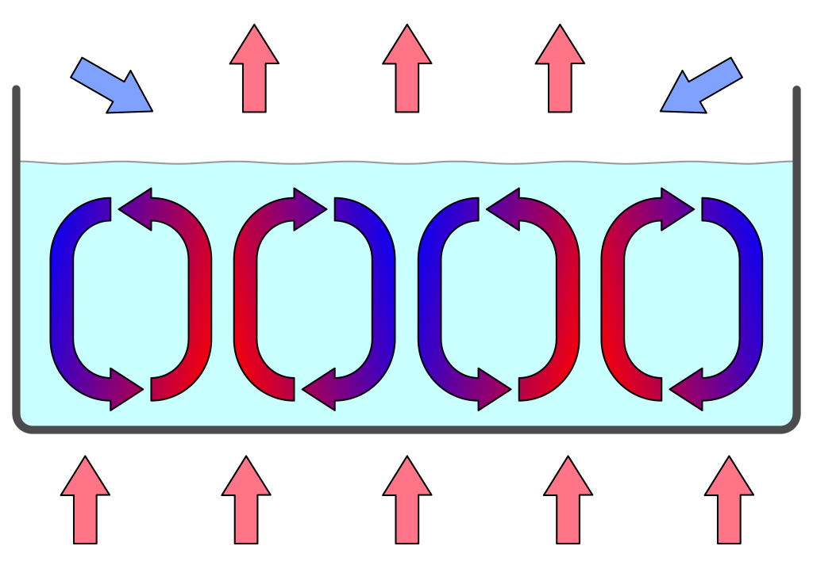
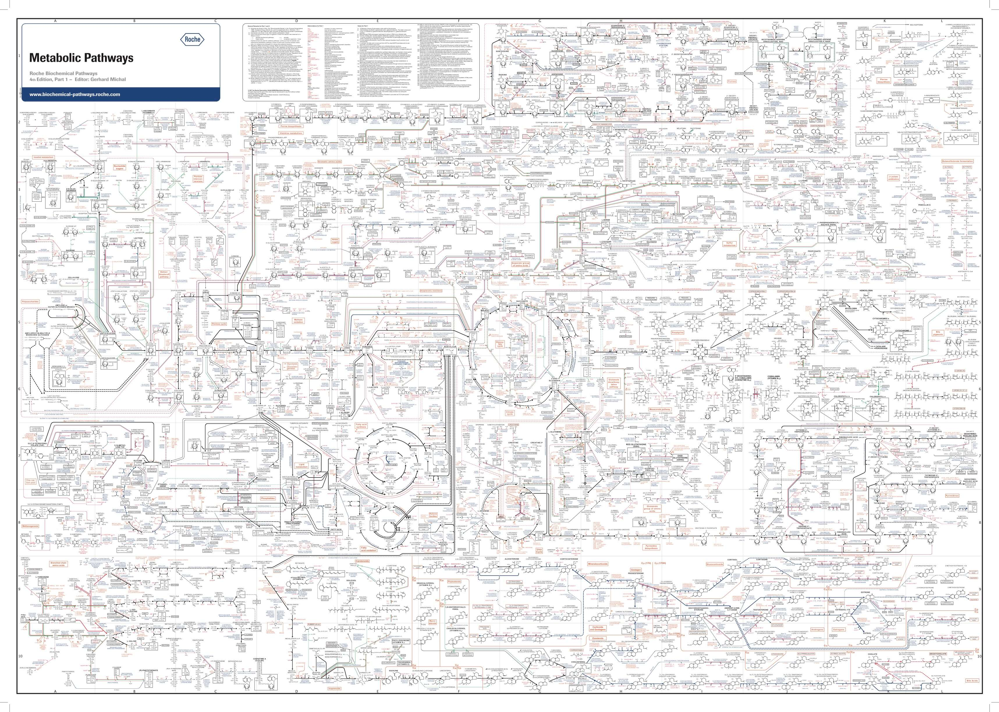
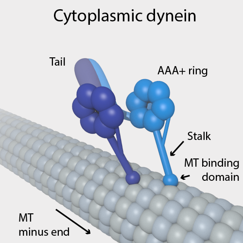

# What is Life?

One of the key drivers for Rolando Toro to develop his System of Biodanza was the disconnection he observed of men and women from the cosmic matrix, throughout our Western history, which has generated destructive cultural forms. This resulted from our Cartesian way of thinking, which caused a fragmented view of life. Indeed, it implied a division between body and mind, humanity and nature, living matter and non-living matter, and it considers the universe as being analyzable in separately existing parts that more or less interact as parts of a machine [@bohm1980]. This fragmented world view disconnected us from the universe that we inhabit and broke up our human society into distinct religious, political, economical and racial groups, among others leading to the exploitation of our natural resources, plants, animals and of fellow humans. 

Ronando, therefore, has put his biocentric principle against this old world view. When formulating his principle, Rolando started from the axiom that "life is the essential condition for the genesis of the universe". In his book on Biodanza [@toro2008] he refers to the universe as a living hologram or the matrix of life, i.e. a self-organising structure that is building life, and his view is that the entire cosmos has to be understood as a gigantic living system, by itself. This principle invites us to radically rethink our relationship as a human being with the entire biosphere that we inhabit. From this point of view, life itself is intrinsically sacred, which probes us to put all living beings, or all of life, at the heart of our weltanschauung.

From my scientific background the axiom that "life is the essential condition for the genesis of the universe" appeared rather radical. However, I immediately felt that Biocentrism "an sich", which starts from the deep astonishment that life, as we know it, simply exists, and puts it at the hearth of our weltanschauung was key for Rolando’s system of Biodanza. Indeed, it starts from the simple fact that life exists, here and now, and that cognition and human growth originate through the vivencia of life. The latter can trigger us to think about our origin and our place in the universe, but more important than these thoughts is the experience, which promotes a deeper cognition from within, and this immediately with our embodied mind that is touched by vivencia.

With his axiom, however, Rolando went one step further. Indeed, in his book on Biodanza [@toro2008], he explicitly mentions that "The universe exists because life exists”, and not that "Life exists because the universe exists", which triggered me to try to grasp his views on the matter. I quickly learnt that Rolando's rationale is deeply rooted in the work of leading scientists. Indeed, Rolando often refers to Christian de Duve and his quotes "Life is a cosmic imperative" and "Life is an obligatory manifestation of matter, written into the fabric of the universe",  Ilya Prigogine's "dissipative structures", "dissipative zones" and "attractors", and Maturana and Varella's "autopoesis" and "autopoetic units", among others. Many of these were concepts to which I had never been exposed in my formal scientific education and that I could not comprehend without consulting the work of the original authors. 

When thinking about science, however, it is crucial, as @bohm1980 nicely formulates, to acknowledge that scientific theories are not "true knowledge" corresponding to "the reality as is", but rather ever-changing insights that are giving shape and form to how we view and experience the world. This reflects my quest in this monograph: to shed light on Rolando's insights on biological aspects, which he enfolded in his model of Biodanza.  

## Rolando Toro's View of Life and his Biocentric Principle

In his book of Biodanza Rolando argues that the universe can be understood as a living system and that "the realm of life embraces much more than the plants, the animals and man. Everything that exists, from neutrinos to quasars, from the fine stone to the most subtle thought, is a part of this prodigious living system", which he often refers to as a gigantic living hologram.

### Holographic Analogy for the Universe

Where did Rolando's holographic analogy for the universe come from? 
The word hologram comes from Greek where the word holos means entire or whole and the suffix gram means something written down or recorded. 
"Holography" is a technique to record a three dimensional image of an object on a two dimensional photographic plate. When a hologram is illuminated in a suitable way, the 3D image can be reconstructed. Even when the holographic record is broken into parts, the 3D image can be reconstructed from each part, albeit with a smaller resolution. Each part of the hologram thus contains information on the whole! 

In conventional holography a laser light beam is split into a beam that is directly led to the photographic plate and a beam that illuminates an object. A hologram is a photographic recording of the light field that originates by the interference^[Interference: when two waves come together they result in a new wave that can have an amplitude that is higher or lower if the waves are in phase or out of phase respectively. Suppose that two identical waves interfere, when they are completely in phase their peaks and valleys are aligned and their interference will result in a new wave with a peak and valley that is twice as high and twice as deep as each of the original waves (constructive interference). When the waves are completely out of phase the peak of the first wave aligns with the valley of the second wave and vice versa so their resulting wave will be flat, i.e. both waves cancel eachother out (destructive interference). Interference can be observed for all types of waves, e.g. light, radio, acoustic, surface water, electric, matter and gravity waves among others.] of the part of the incoming light beam that is directly led to the photographic plate with the part of this beam that has been scattered upon illuminating an object. 
When illuminating the photographic record with a laser beam the 3D image can than reconstructed e.g. see figure \@ref(fig:hologram1). The recording at every spot on the photographic plate is the result of the interference of light waves of the original light beam with light waves that are scattered back by all locations of the object. Each part of the record thus contains information of the whole object unlike a traditional photograph where there is a point-to-point correspondence of the object and the recorded image. As @bohm1980 nicely phrases it in a hologram "form and structure of the entire object may be said to be enfolded within each region of the photographic record" and "when one shines light on any region, this form and structure are unfolded to give a recognizable image of the whole object once again". 

```{r hologram1, fig.cap='Holographic recording and reconstruction. (Source: Bob Mellish, Wikipedia)',  out.width='100%', fig.asp=.8, fig.align='center', echo=FALSE ,fig.show='hold'}
knitr::include_graphics(c("./figs/holographySmall.png"))
```

In quantum mechanics, both matter and electromagnetic waves (such as light, microwaves and X-rays amongst others) have a particle and wave character, and every physical structure is defined by a wave function that in principle extends over the whole universe. @bohm1980 points out that quantum mechanics allows us to understand the universe and the reality as an unbroken totality, as a whole. He intuitively explains this in the following insightful example: "when we look to the night sky we are able to discern structures covering immense stretches of space and time, which are in some sense contained in the movements of light in the tiny space encompassed by the eye and (...) also how instruments (...) can discern more and more of this totality, contained in each region of space." This illustrates how according to these insights, information on the entire universe, or on its *total order*, is *enfolded* or contained in some implicit sense, in every region of space-time and how it can be *unfolded* by our eye or instruments. @bohm1980 further argues that this enfoldment and unfoldment does not only applies to light waves, but extends to electromagnetic waves in general, as well as to other waves such as to the electronic, protonic, gravitational, sound waves, etc. and even towards fields that are yet unknown and may be discovered later.    

@bohm1980 therefore replaced the old Cartesian analogy of the universe as a machine by a novel analogy: that of a holographic universe, which refers to its unbroken and undivided totality that is enfolded in every region of space-time.  

So when Rolando was referring to the universe as a living hologram, he expressed his view that life is part of this unbroken and undivided totality that is enfolded in every region of space-time. 

To get a better understanding of this view, we will introduce Bohm's example of a sunflower seed from which an entire plant is growing. 
```{r, eval=knitr::is_html_output(excludes = "epub"), results = 'asis', echo = F}
cat('
<div><div style="position:relative; padding-top: 56.25%">
<iframe src="https://www.youtube.com/embed/_owPRdbaMdY?si=Hpee5spcKofhWsEo" frameborder="0" allowfullscreen
      style="position:absolute;top:0;left:0;width:100%;height:100%;"></iframe>
</div></div>'
)
```
*Timelapse of a growing sunflower (Source: https://www.youtube.com/watch?v=_owPRdbaMdY)*

The plant is also holographic. Indeed  each of its cells contains all information from the seed, i.e. all its DNA as well as its cellular structure. @bohm1980 further points out that the seed contains little to nothing from the actual biomass of the plant that it has developed. The seed merely contains the information that is required to transform its environment to grow the plant from solar energy and the chaos of simple molecules CO$_2$, nitrogen, phosphorous, etc. Remarkably, the plant will eventually produce new seeds, which will spread its information further throughout the environment and will transform it over and over again to grow plants. It thus becomes obvious that we no longer need to make the distinction between "inanimated" and "animated" matter. Indeed, if we would stick to this old Cartesian way of thinking we are confronted with confusing questions like when would a so-called "inanimated" carbon atom become animated? As soon as it enters the leaf stomata or when it is assimilated into an organic compound? Does the carbon atom becomes inanimated again when it is released from the plant as it burns the sugars it has assimilated into CO$_2$ during the night? All these confusing questions spontaneously resolve when considering the universe as an unbroken and undivided totality. Indeed, from this paradigm we consider that the environment is augmented with the information of the seed, which somehow seems to direct its environment to grow a corresponding plant. So life itself can be regarded as belonging to a totality including plant and the environment. Life is somehow enfolded in this totality and already implicitly present even before it is unfolded and explicitly manifests itself. Indeed, the ensemble of all atoms that eventually will form the plant that will grow from a certain seed are already present in the environment. It is the information in the seed that is somehow restructuring them to grow the plant. In this way, so-called "inanimated matter" can be seen as a subtotality of the whole in which life can be unfolded, for instance when the environment is enriched with the information from a plant seed. So @bohm1980 concludes that "we do not need to fragment the whole into life and inanimated matter, nor do we have to try to reduce life completely to nothing but an outcome of the latter". 

The sunflower seed example is a wonderful illustration of the synergy between anabasis and catabasis. The process of catabasis when the sunflower dies and disintegrates goes hand in hand with new life that lies hidden in the seeds. Once the seeds germinate in a new environment anabasis or the process of integration and restructuring the environment begins all over again.

The example also shows how relative time is and how each life can be seen as a cosmic dance. The dance of the sunflower roughly took hundred days. Our dance takes about a century.  So from the sunflower example we can learn that we have to be patient with our growth, it will take time to transform our social environment. It also illustrates that we can be confident that everything is already present in our environment. We only have to take the time and have the courage to transform our environment towards growth. 

Note, that the seed example also demonstrates how powerful the concept is of an enriched environment: when we enrich the environment with the information in the plant seed, the environment is somehow directed to grow this magnificent sunflower. This analogy can be taken to our human realm and was exactly what Rolando intended with Biodanza: providing an enriched environment that can influence our ontogenesis, i.e. how Biodanza creates the information or the ecofactors that enrich our environment to trigger our evolution as a human being and this both on a physiological and psycho-socio-emotional level. As in the sunflower seed example, we can then germinate in our own social environment and transform it with our growth. 

<!--  

-->
 
### The Universe as a Self-organising Structure 

Rolando also referred to the universe as the matrix of life, i.e. a self-organising structure that is building life and that has to be understood as a gigantic living system by itself.

The universe as we know it likely started off with the big bang: a massive spike of energy. Shortly after the big bang, matter was formed. As @davies1987 describes it, this matter was rather formless existing of subatomic particles more or less uniformly distributed in space at a more or less uniform temperature.
Paul Davies further argues that the universe than gradually has been unfolding from this largely featureless state towards its current richness in physical and chemical forms and structures as it is ageing. Or to quote him: "the creative power of nature manifested mainly AFTER the initial flash of existence". Indeed, the creative ability of nature continues through all time.

Ilya Prigogine was one of the first scientists who developed the theory to explain how matter and energy have the innate ability to bring about self-organising processes. Convection currents are for instance an example of a simple physical process generating massive structures. They can be observed when simply heating a shallow layer of fluid or gas from below, which establishes a temperature gradient that lets the fluids rest state to become unstable. Indeed, the warmer fluid at the bottom is lighter and starts to float to the top where it cools down again, whereas the colder fluid at the top is more heavy and sinks to the bottom, where it is heated. Large ensembles of molecules therefore start to exhibit coherent patterns of motion (see Figure \@ref(fig:convectionCells)).

```{r convectionCells, fig.cap='Convection cells in a gravitational field. A fluid layer is heated from the bottom. The warmer fluid at the bottom becomes lighter and floats to the top where it cools down again, whereas the more heavy colder liquid sinks to the bottom where it is heated. This organizes the fluid layer in hexagonal convection cells (Source: Wikipedia - users Eyrian and Con-struct)', out.width='80%', fig.asp=.8, fig.align='center', echo=FALSE}

```

The convection motion leads to a spontaneous complex spatial organisation, almost a dance, of billions of molecules moving coherently and forming hexagonal convection cells. Such convection cells can be observed in a small dish of a fluid in a lab, up to the level of the earth's atmosphere and the solar photosphere (see movie below). 

```{r, eval=knitr::is_html_output(excludes = "epub"), results = 'asis', echo = F}
cat('
<div><div style="position:relative; padding-top: 56.25%">
<iframe src="figs/granulation_sun.mp4" frameborder="0" allowfullscreen
      style="position:absolute;top:0;left:0;width:100%;height:100%;"></iframe>
</div></div>')
```

*Movie of the solar photosphere observed with the Swedish 1-m Solar Telescope (SST) on La Palma, Spain. The movie shows solar granulation which is a result of convective motions of bubbles of hot gas that rise from the solar interior. When these bubbles reach the surface, the gas cools and flows down again in the darker lanes between the bright cells. In these so-called intergranular lanes, we can also see small bright points and more extended bright elongated structures. These are regions with strong magnetic fields. (Source: Wikipedia, user Luc.rouppe, link: https://en.wikipedia.org/wiki/File:Granulation_Quiet_Sun_SST_25May2017.webm)*

Prigogine showed that spontaneous self-organisation also occurs in chemical systems that are operated far from equilibrium by continuously pushing matter and energy through it. These self-organising processes are largely unpredictable and spontaneously arise in our universe.
@prigogineStengers1984 further argue that such chemical and physical processes are the basis of the complex self-organisation that we observe in living systems. 

So instead of clinging to the destructive division of humanity and nature, or to the equally destructive idea that we humans are an incidental and irrelevant feature of the cosmos, we rather can embrace ourselves as children of our universe. A result of its remarkable creativity with a beauty similar to all magnificent self-organising structures that are surrounding us. 


### Organisation of This Chapter

The remaining of this chapter builds on the work of five scientists who were very influential and whose insights can help us to increase our understanding on the biological aspects that Rolando Toro included in his Model for Biodanza: 

- Erwin Schrödinger who explicitly defined life as structuring "order-from-disorder", 
- Ilia Prigogine who developed the theory for this and coined the term "Dissipative Structures",
- Christian de Duve one of the founding fathers of biochemistry, and 
- Humberto Maturana and Francisco Varela with their concept of autopoiesis.


Note, that the subsections in "Christian de Duve: a biochemical view of life" always start with a general overview followed with subsections including more technical details. I have chosen to include these technical details in this monograph because they can help interested readers to understand all terms and concepts that are only touch upon very briefly in the reader of the Biodanza teacher training "Module IV: Biological Principles of Biodanza". The sections "Maturana and Varela: a Systems View of Life" and "Links to Vital Unconsciousness" are more philosophical in nature. 

\newpage 

## Schrödinger and Prigogine: a Thermodynamic View of Life

In his seminal lecture series: "What Is Life? The Physical Aspect of the Living Cell" @schrodinger1944  defined life as 

1. an open system that can generate order from chaos by exploiting external energy sources,

2. with the capacity to transmit its own specific blueprint from generation to generation.

Note, that in his seminal lecture series @schrodinger1944 also laid out key functions of the molecule that was involved in this specific blueprint and this while DNA was not even discovered.

At first, the property that life can generate order or structure seems to contradict the second law of thermodynamics that states that: a system is always gearing towards maximal entropy.

Entropy can be loosely defined as a physical quantity for the level of how energy is spread out. It is thus the tendency of a system to evolve from a concentrated energy state to an energy state that is more spread out. This can be easily understood from a simple example known to each of us: if you put a hot pot in a large room, the pot will cool down and the temperature in the room will slightly rise until the pot and the room have the same temperature. As a result the concentrated heat energy from the pot is nicely spread out over the entire room. So the increase in entropy is the analogy of catabasis in the realm of physics.  

Schrödinger understood that life was not violating this second law. Indeed, by being an *open* system, it can interact with the environment, and by eating and breathing there has to be a way of "concentrating order" or maintaining a higher more concentrated energy state. 

Prigogine was the first one who provided the theoretical framework for a type of chemistry that is key for life [@prigogineStengers1984]. He realized that the chemistry of life is totally different from most chemical systems that were studied up to then. Indeed, the chemistry and processes of life are highly non-linear with many feedback loops^[A feedback loop in a chemical system occurs if part of the produced molecules are used again as input.] and are operated far from equilibrium by continuously pushing matter and energy through it.

We intuitively know the latter: our body is typically at a higher energy state than the corresponding material in a non-living state. We can simply acknowledge that as we are hotter than the room, and a crude way to estimate how long we are death is by measuring the temperature of a corpse. To maintain our higher energy state, to concentrate chemicals in our cells, and, to build complex molecules, cells and tissues from it, we have to keep on eating and breathing.  

\pagebreak 

### Dissipative Structures

Prigogine discovered that complex self-organising systems can spontaneously arise if they are open and can exchange lots of energy and matter with their surroundings. 
Key for this *anabasis* is a chaos of matter and a flow of energy through the system.
In chemical systems, and life is to a large extent chemistry, the influx of energy allows the generation of structure while producing lots of entropy by dissipation. Dissipation means that energy has been converted from one energy form to another and that it can no longer be converted back in its original form. So dissipation is irreversible, which adds the arrow of time to life.   Indeed conversion of energy to heat inherently takes place in all underlying chemical reactions and these cannot be reversed without the addition of new energy. Hence, a large part of the concentrated energy that enters cells through sunlight or chemical energy in food, is spread out in a less concentrated energy form: heat. 

The structure that spontaneously emerges in living organisms is thus not violating the second law because of the rise in entropy by the dissipation of heat, which again shows how the processes of anabasis and catabasis go hand in hand. 
Prigogine therefore coined the novel term dissipative structures for such systems. 

### Attractors 

In the reader of the Biodanza teacher training "Module II Vital Unconsciousness and Biocentric Principle" Rolando Toro often uses the term attractor.  Dissipative structures typically have multiple attractors, i.e. states, regimes, forms, shapes or structures to which they spontaneously evolve. The specific attractor to which the system is organising itself highly depends on the initial environmental conditions. 
Note, that dissipative structures are also characterized by feedback loops. 
These feedback loops allow the system to remain at its current attractor upon changes in the environment, e.g. a kind of homeostasis.
However, some environmental stimuli are amplified by the feedback loops and can switch the dissipative structure towards another attractor and thus induce a regime switch. 

Prigogine argued that chemistry in cells, cells itself, tissues, organs, organisms, populations of organisms, ecosystems and our globe can be seen as dissipative structures [@prigogineStengers1984].
The fruiting body of slime molds are a compelling example of a living system that often changes from attractor, see Figure \@ref(fig:Dictyostelium). Dictyostelium slime molds, spend most of their lives as separate single-celled amoeba. But, upon stress one of the amoebas releases a chemical signal cAMP. Others detect this signal, and respond in two ways: the amoeba moves towards the signal and secretes more cAMP effectively boosting the signal. So the signal gets amplified by a feedback loop which eventually triggers the system to switch from their current attractor - a state of free living amoebas - towards a novel attractor - their fruiting body - that will release spores and will spread the slime molds towards novel environments (see e.g. youtube movie https://youtu.be/bkVhLJLG7ug).

```{r, eval=knitr::is_html_output(excludes = "epub"), results = 'asis', echo = F}
cat('
<div><div style="position:relative; padding-top: 56.25%">
<iframe src="https://www.youtube.com/embed/bkVhLJLG7ug?si=hZ3ynS2XX6UcySuu" frameborder="0" allowfullscreen
      style="position:absolute;top:0;left:0;width:100%;height:100%;"></iframe>
</div></div>'
)
```

\pagebreak 

```{r Dictyostelium, fig.cap='Stages of Dictyostelium lifecycle. (A - B) Dictyostelium cells chemotaxing toward cAMP released from a micropipette. Cells that have not yet sensed cAMP are shown in (A). Within 1 or 2 min the cells polarize and migrate toward the source of chemoattractant (B). (C - D) Scanning electron micrograph of streaming Dictyostelium cells (C) and the formation of aggregates (D). (E) Formation of aggregation centers on an agar plate. (F) Slugs moving on an agar plate. (G) Culmination stage. (H) Fruiting body. Figure from Müller-Taubergen et al. 2012', out.width='60%', fig.asp=.8, fig.align='center', echo=FALSE}
knitr::include_graphics("./figs/Dictyostelida.jpg")
```

The Dictyostelium example also clearly shows how hard-wired and precise instincts are shaped, and how closely they are linked to the biochemistry of an organism. We can recognize the instincts of 

- exploration in the free living amoebae 
- tropism when all amoebae turn and start to move in the direction of the cAMP cue
- conservation, solidarity and sexuality when they organize themselves in a fruiting body.

These instincts are shared between all life forms, however, their expression is differentiated at a different level in distinct species. So instincts are the attractors of life. Therefore, the liberation of our instincts was so important for Rolando Toro. With Biodanza we will reconnect to and strengthen our instincts along the five lines of Biodanza, which are each connected to these overarching instincts, e.g. the instinct of conservation is connected to line of vitality, sexuality to the line of sexuality, exploration to the line of creativity, solidarity to line of affectivity, and tropism to the line of transcendence^[Note, that we only included the instincts that we observed in the Dictyostelium example. Hence, more overarching instincts are linked to these five lines, which can be found in the Rolando's book on Biodanza.].


### Dissipative Zones 

In the reader of the Biodanza teacher training "Module II Vital Unconsciousness and Biocentric Principle" it is also mentioned that we live in a dissipative zone. Indeed, our whole globe can be seen as a large dissipative structure located in our solar system, which is a dissipative zone. 

1. There is an energy source, the sun that is radiating concentrated energy in photons.

2. Life forms are organising structure from the chaos of molecules on Earth by dissipating energy from the solar photons, light and UV, to heat through their organic pigments, e.g. chlorophyll. 

3. Animals, bacteria and fungi are secondary dissipative structures that are feeding on the concentrated chemical energy in the form of sugar, starch, proteins and fats that are produced by plants and cyanobacteria. They again dissipate energy in the form of heat through respiration. 

4. The heat produced by life is dissipated to water and air and this  induces tertiary dissipative processes like the water cycle, wind and sea currents etc. 

5. Eventually heat is radiated to space, which acts as an energy sink. 

Because the temperature of Earth remains roughly stable, more or less a similar amount of energy is radiated to space under the form of heat as what comes in under the form of photons from the sun. As the energy content of heat is lower and more disperse it has a higher entropy than that of the incoming sunlight.
Because almost no mass is exchanged between Earth and space, mass has to be recycled and life is inherently cyclic. 

This cyclic nature with its eternal reappearance is key for renewal and vitality, and has been recognized in all human cultures in their rich rituals that celebrate this cyclic origin. Biodanza also recognizes the importance of connecting and resonating with our cyclic origin. Indeed, biological regression in Biodanza is a moment of returning to, connecting with and the reappearance of our origin, which revitalize and initiates processes of renewal on a biological, physiological as well as on a psycho-socio-emotional level. 


\newpage 

## de Duve: a Biochemical View of Life

In his Book "Life Evolving - Molecules, Mind and Meaning", @deDuve2002 gave a very simple but brilliant definition of life: 

Life is 

1. One,
2. Chemistry, and 
3. Information 

In the following sections we will explore what de Duve meant with each component in his definition. Note, that each section starts with the key idea and then consists of more technical subsections that introduce the biological concepts in the reader "Module IV Biological aspects of Biodanza" in more detail. 

### Life is One {#lifeOne}

The first part in the definition of de Duve, "Life is One", has been instrumental for Rolando Toro when he coined the term "Vital Unconsciousness". 

Life is one because all living organisms on earth

- are built of cells
- evolved from the same species, LUCA, our last universal common ancestor 
- use the same molecule for storing, converting and using energy
- use the same biological building blocks: lipids, sugars, amino acids for proteins and nucleic acids (DNA and RNA).


#### All Living Organisms are Built of Cells

"Life is One" because all organisms are composed of cells. 
Green algae that can perform photosynthesis are a beautiful example of unicellular organisms. They were key for the development of life on our planet by releasing oxygen in our atmosphere (Figure \@ref(fig:greenAlgae)). 

```{r greenAlgae, fig.cap='Cyanobacteria, unicellullar organisms that can perform photosynthesis. They were key in the development of life and radically changed Earth by releasing oxygen to our atmosphere (Source: Chisholm Lab, Wikipedia)', out.width='30%', fig.asp=.8, fig.align='center', echo=FALSE}
knitr::include_graphics("./figs/Prochlorococcus_marinus.jpg")
```

A vital component of a cell is its membrane (the outer layer of the cell) that is separating them from their environment while enabling them to interact with it and to concentrate chemicals inside the cell.


Multicellular organisms are composed of multiple cells. The cells are organised in 
tissues, e.g. spongy tissue in our bones or epithelium cells of our stomach; organs, e.g. bones or our stomach; organ systems, e.g. skeleton or digestive system; upto the organism. Figure \@ref(fig:multiCellular) also shows how organisms are further organised in populations of organisms, ecosystems, and eventually our entire Biosphere. So "Life is One" because all living organisms consist of cells that are organised in large networks that work together. 

```{r multiCellular, fig.cap='Multicellular organisms and biological organisation (Source: mrssmithsbiology)', out.width='30%', fig.asp=.8, fig.align='center', echo=FALSE}
#knitr::include_graphics("https://mrssmithsbiology.files.wordpress.com/2019/10/picture4.jpg")
knitr::include_graphics("./figs/organisationMulticellular.jpeg")
```

\pagebreak 

#### Last Universal Common Ancestor

"Life is One" because all species evolved from the same ancestral population of cells. 
This is also referred to as the Last Universal Common Ancestor (LUCA). It is nicely indicated by the tree of life in Figure \@ref(fig:treeOfLife), which is one of the most important organising principles in biology. It shows the evolutionary relationships among different organisms and that all living beings eventually can be traced back to LUCA who is located at the root of the tree.  Note, that the animal kingdom to which we belong is only a small branch in the tree.   

```{r treeOfLife, fig.cap='The tree of life is one of the most important organising principles in biology. It shows the evolutionary relationships among different organisms and also that all living beings eventually can be traced back to the last universal common ancestor (LUCA), who is located at the root of the tree (Source: Wikipedia)', out.width='80%', fig.asp=.8, fig.align='center', echo=FALSE}
knitr::include_graphics("./figs/Phylogenetic_tree.svg")
```

#### Energy Coin {#sectionEnergyCoin}

"Life is One" because all living organisms use the same "energy coin", the ATP-ADP system, to store and reuse energy^[Explained in technical terms, Adinosine-triphosphate (ATP) consists of a ribose sugar with 3 phosphate groups and a base adinine. 
Splitting a phosphate group from adinosine-triphosphate (ATP) results in adinosine-diphosphate (ADP), a free phosphate group and energy. 
The other way around, energy can be stored as chemical energy by binding a phosphate group to ADP.] (see Figure \@ref(fig:atp-adp)).
Note, that ATP is also used to build RNA, an important molecule involved in storing, passing and expressing our genetic information^[Indeed, ATP is incorporated in RNA upon splitting two phosphate groups. The resulting AMP (adinosine monophosphate) is one of the building blocks of RNA. See Section \@ref(sectionNucleicAcids) for more details on RNA.].  So there is a close link between energy and genetic information!


(ref:atp-adp-cap) Our energy coin ATP-ADP. Adinosine-triphosphate (ATP) consists of a base adinine, a ribose sugar and 3 phosphate groups. Splitting a phosphate group from adinosine-triphosphate (ATP) by a reaction with water (H$_2$O) results in adinosine-diphosphate (ADP), a free phosphate group and releases energy. The other way around, energy can be stored as chemical energy by binding a phosphate group to ADP (Source: Adapted from Wikipedia)

```{r atp-adp, fig.cap='(ref:atp-adp-cap)', out.width='70%', fig.asp=.8, fig.align='center', echo=FALSE}
knitr::include_graphics("./figs/ATP-ADP.png")
```

\pagebreak 

#### Building Blocks of Life 

"Life is One" because all living organisms are composed of the same basic bio-molecules and we all know more than we think about them because we are what we eat!  

Almost all molecules of living organisms are composed of

1. Lipids, oil and fats, for storing energy and as building blocks for membranes,
2. Carbohydrates, sugars, for storing energy and as a backbone of large bio-molecules,
3. Amino acids, the building blocks of proteins, which are the workhorses of a cell and facilitate the majority of its chemical reactions, and
4. Nucleic Acids, building blocks of RNA and DNA, which are used to store and use the genetic information we inherit from our parents.

Below, we focus on each of these building blocks in more detail. Readers who would like to skip technical details can immediately go to section \@ref(lifeChemistry) Life is Chemistry.


##### Lipids 


```{r lipids, fig.cap='Phospho-lipids have a very important role in life as they form membranes. Phospholipids have a hydrophilic head that likes to mix with water and long hydrophobic tails that do not mix with water. They sponteneously gives rise to bilayers in aqueous solutions similar to the structure seen in membranes. Membranes are the boundaries of the cell and they allow passivie diffusion of small molecules through their bilayer. Larger molecules can be actively exchanged with the environment through membrane proteins (Source: Doug Hatfield, Wikipedia)', out.width='80%', fig.asp=.8, fig.align='center', echo=FALSE}
knitr::include_graphics("./figs/Cell_membrane_detailed_diagram_4.svg")
```

Lipids, fats and oils, are used for storage of energy, regulation of hormones, transmission of nerve impulses, cushion vital organs and transport of fat-soluble nutrients. Moreover, an important class of lipids, the phospholipids, make up membranes of cells and unicellular compartments called organelles see Figure \@ref(fig:lipids). Indeed phospholipids have a polar head that likes to be in water and a long apolar tail that does not mix with water. Therefore bilayers of phospholipid molecules are spontaneously formed in aqueous solutions. 

\pagebreak 

Membranes provide the basis for concentrating specific molecules in (compartments of) living cells. This enable cells to build up a disequilibrium of chemical molecules that  can perform  work as a concentration gradient spontaneously dissipates toward its equilibrium value. So phospholipids are key for creating the boundary conditions necessary for cellular organization.

##### Carbohydrates 

Carbohydrates are important bio-molecules that are used for storage, energy and structure (Figure \@ref(fig:carbohydrates)).

```{r carbohydrates, fig.cap='Carbohydrates perform the important functions of storage, energy source and structure. They can be organised in biopolymers, long chains of carbohydrate molecules that are bound together. The polysaccharides starch and glycogen for instance are used to store energy by plant and animal cells, respectively. Cellulose, on the other hand, is a polysaccharide that gives plants structure. Deoxyribose and ribose are important carbohydrates that form the backbone of the biopolymers DNA and RNA, respectively. (Source: thebiologynotes.com)', out.width='100%', fig.asp=.8, fig.align='center', echo=FALSE}
#knitr::include_graphics("https://thebiologynotes.com/wp-content/uploads/2020/11/Carbohydrates-definition-classification-with-structure-and-functions.jpeg")
knitr::include_graphics("./figs/Carbohydrates-definition-classification-with-structure-and-functions.jpeg")
```

- Storage: glucose is stored inside animal cells using glycogen, a polymer of thousands of glucose molecules that are bound to each-other. Plants use a similar molecule, starch. 
- Energy source: specific proteins can split glycogen and starch into glucose that is subsequently metabolized for energy. 
- Structure: carbohydrates form the backbone of many bio-molecules, e.g. long chains of desoxyribose and ribose act as the backbone of the bio-polymers DNA and RNA, respectively; and glucose is the backbone of cellulose, which give plants structure. 

```{r, eval=knitr::is_html_output(excludes = "epub"), results = 'asis', echo = F}
cat('
</br>'
)
```

\pagebreak 

##### Amino Acids {#sectionAminoAcids}

Amino acids by themselves are simple molecules (Figure \@ref(fig:aminoAcids)).
Although hundreds of amino acids exist in nature, life is using only 20 of them and it is combining them in long molecules, polymers, which are referred to as proteins.
Proteins are hetero-polymers, consisting of the 20 amino acids that are arranged in long sequences that differ from protein to protein. 
So unlike starch, that only consists of glucose molecules that are all identical, proteins are capable of carrying information.

(ref:aminoAcidsCap) Amino acids are simple molecules. They can be combined  in long molecules, polymers, also known as proteins. Their long chain of amino acids spontaneously folds into a complex 3D structure from which their biological function emerges (Source: thebiologynotes.com)

```{r aminoAcids, fig.cap='(ref:aminoAcidsCap)', out.width='100%', fig.asp=.8, fig.align='center', echo=FALSE}
#knitr::include_graphics("https://thebiologynotes.com/wp-content/uploads/2020/12/Amino-acids-and-Proteins.jpeg")
knitr::include_graphics("./figs/Amino-acids-and-Proteins.jpeg")
```

The crux of proteins is that their long chain of amino acids spontaneously folds into a complex 3D structure, which is determined by the properties and the specific sequence of its amino acids. From their complex and specific 3D structure their biological function emerges. 

Indeed, many proteins work as a "lock" in which specific (bio)molecules fit as a "key". This enables proteins to bring molecules close together and to promote chemical reactions without being consumed.  This process is also referred to as catalysis and proteins that perform catalysis are called enzymes, see Figure \@ref(fig:enzyme).

```{r enzyme, fig.cap='Diagram of a protein performing an enzyme action (Source: Wikipedia)', out.width='50%', fig.asp=.8, fig.align='center', echo=FALSE}
knitr::include_graphics("./figs/EnzymePadlockKey.png")
```

Proteins are the main workhorses of the cell and they are important for moving food, digesting food, copying DNA, for giving the cell structure, affecting the rates at which other proteins work, etc... 

##### Nucleic Acids {#sectionNucleicAcids}

Nucleic acids are build of nucleotides. 
Each nucleotide is composed of one of four nitrogen-containing nucleobases, which carry the information

1. cytosine [C], 
2. guanine [G], 
3. adenine [A] or 
4. thymine [T] (DNA) or uracil [U] (RNA) , 

a phosphate group and a sugar, i.e. ribose in ribonucleic acid (RNA, Figure \@ref(fig:RNA)) and deoxyribose in deoxyribonucleic acid (DNA, Figure \@ref(fig:DNA)).

These nucleotides are the building blocks that are combined in long polymers: RNA and DNA. 
DNA and RNA are hetero-polymers and the nucleotides conceptually can be combined in any order.
So they can contain information. 
Indeed, they are key to store and use the genetic information we inherit from our parents. 

DNA typically occurs as a double strand, where C and G, and, A and T hybridize to each other using respectively three and two hydrogen bridges to form the iconic double stranded helix structure, see Figure \@ref(fig:DNA). 

There is a general consensus that life probably began by using RNA as information carrier. 
DNA, however, is much more stable and lasts longer in water than RNA. Therefore, DNA probably emerged later and is now used to store the genetic information in most organisms. 

Life is also one because we share the same genetic code, but we refer to Section \@ref(lifeInformation) "Life is Information" for more details.

```{r RNAvsDNA, fig.cap='Nucleic acid: RNA (left) and DNA (right). RNA appears typically in a single strand and DNA as a double stranded molecule (Source: Wikipedia)', out.width='50%', fig.align='center', echo=FALSE}
knitr::include_graphics("./figs/Difference_DNA_RNA-EN.svg")
```

```{r RNA, fig.cap='RNA is a polymeric molecule with various biological roles in coding, decoding, regulation and expression of genes. RNA consists of a chain of nucleotides. Each nucleotide is build from a ribose sugar that forms the backbone of the RNA  polymer, a phosphate group that is used to connect the ribose sugar molecules and a base adenine (A), cytosine (C), guanine (G) or uracil (U) that are the carriers of information. The bases can form hydrogen bonds between cytosine and guanine, between adenine and uracil, and, between adenine and thymine (a base from DNA) (Source: Adapted from Wikipedia)', out.width='50%', fig.align='center', echo=FALSE}
knitr::include_graphics("./figs/RNA-Nucleobases.png")
```
```{r DNA, fig.cap='DNA is a polymer composed of two polynucleotide chains that coil around each other to form a double helix carrying genetic instructions for the development, functioning, growth and reproduction of all known organisms and many viruses. Each DNA single strand consists of a chain of nucleotides. Each nucleotide is build from a deoxyribose sugar that forms the backbone of the DNA  polymer, a phosphate group that is used to connect the deoxyribose sugar molecules and a base adenine (A), cytosine (C), guanine (G) or thymine (T) that are the carriers of information. The bases form hydrogen bonds between cytosine and guanine, and, adenine and thymine to assemble single stranded DNA in double stranded DNA. (Source: Wikipedia)', out.width='50%', fig.align='center', echo=FALSE}
knitr::include_graphics("./figs/DNA_Nucleotides.jpeg")
```


\newpage

### Life is Chemistry {#lifeChemistry}

"Life is Chemistry" because a cell consists of a complex network of chemical reactions that are connected to each other. Many feedback loops exist in this chemistry making it largely nonlinear. The feedback loops enables a cell to maintain in its regime or to switch from regime or attractor upon external and/or internal stimuli. An overview of most reactions in a living cell is given in Figure \@ref(fig:chemicalReactionsCell). I only included this overview to provide the reader with a sense of the complexity and the wealth of chemistry that takes place in each single cell. You can zoom in on this map on http://biochemical-pathways.com/#/map/1.

```{r chemicalReactionsCell, fig.cap='Network of the most important reactions in a living cell (Source: Dr. Gerhard Michal, Roche)', out.width='100%', fig.asp=.8, fig.align='center', echo=FALSE}

```

In the remainder of this section we will introduce energy and catalysis in more detail, and we also give an intriguing example of how proteins play a role in the self-organisation of a cell. Readers who would like to skip technical details can immediately go to section \@ref(lifeInformation) Life is Information.

#### Energy 

"Life is Chemistry" because it uses chemical reactions to store and use energy. See the ATP-ADP system in Section \@ref(sectionEnergyCoin)

#### Catalysis

"Life is Chemistry" because most chemical reactions are catalyzed, i.e. initiated, promoted and made faster by proteins. The proteins facilitate the reaction without being used. The reactions would never take place if we would only mix the molecules at the concentrations that are typically occurring in a cell.  

A catalyst is a chemical substance that helps a reaction to take place without being consumed. Proteins that are catalysts are also referred to as enzymes.

Enzymes are proteins that  

- initiate the reaction
- speed up the reaction and
- make sure that the outcome is always the same.
    
Loosely speaking they are

- "fishing" certain molecules from the complex mixture in a cell, 
- which consists of thousands of chemical compounds generally at low concentrations, 
- through binding sites they can facilitate that these molecules (substrates) are getting close so that they can react and form a new compound. 

These binding sites emerged from to the unique 3D structure of the protein. In Figure \@ref(fig:enzyme) a schematic overview is given of the enzyme action of a protein. 

In most cases enzymes work together in pathways, which consist of multiple chemical reactions for which (part of the) molecules produced in the previous reaction are used by another enzyme to facilitate the next reaction. 

The Krebs cycle is a well known example. This pathway is the main source of energy for a cell through metabolising carbohydrates, lipids and/or proteins (catabasis). The Krebs cycle is a cyclic pathway of multiple chemical reactions each catalyzed by another enzyme (see Figure \@ref(fig:krebsCycle) or the you tube movie  https://www.youtube.com/embed/yk14dOOvwMk).

The Krebs cycle is also used to generate building blocks for constructing certain nucleotides and amino acids (anabasis). 

So, the Krebs cycle is another example of catabasis and anabasis that go hand in hand. 

```{r krebsCycle, fig.cap='Krebs cycle, a cyclic pathway connecting multiple reactions that provide the main source of energy for our cells by metabolising carbohydrates, proteins and lipids. Each reaction is catalised by an enzyme  (Source: Narayanese, Wikipedia)', out.width='70%', fig.asp=.8, fig.align='center', echo=FALSE}
knitr::include_graphics("./figs/Citric_acid_cycle_with_aconitate_2.svg")
```

We can end this section with a quote of @deDuve2002: "Any living organism is a reflection of its enzyme arsenal".
 
\pagebreak 

#### Self-Organisation

Life is also characterized by its ability for self-organisation. Some proteins are also important to give structure to a cell and they can spontaneously form structure. 
An intriguing illustration of self-organisation is provided by @Cheng2019 who 
homogenized Xenopus laevis egg cell cytoplasma extracts, i.e. the liquid with structures from the cell, and showed that the homogeneous extract spontaneously reorganized itself in cell like structures in a matter of minutes (see Figure \@ref(fig:selforganisation) and you tube movie https://www.youtube.com/embed/prq1Occu22s). 

(ref:selforganisationCaption) Homogenized Xenopus laevis egg cytoplasmic extracts spontaneously organized into cell-like compartments [@Cheng2019]

```{r selforganisation, fig.cap='(ref:selforganisationCaption)', out.width='100%', fig.asp=.8, fig.align='center', echo=FALSE}
knitr::include_graphics("./figs/selforganisation.jpg")
```

```{r, eval=knitr::is_html_output(excludes = "epub"), results = 'asis', echo = F}
cat('
</br>
'
)
```

@Cheng2019 found that ATP, the energy currency of a cell; microtubuli, a kind of filamentous proteins; and dynein, a kind of motor protein, were required and driving this process of self-organisation.

```{r dynein, fig.cap='Microtubulus (long filamentous protein) with Dynein motor protein attached (Source:  Wikipedia)', out.width='30%', fig.asp=.8, fig.align='center', echo=FALSE}

```

Note, that proteins thus play a central role in life. They are key for catalysis and giving structure. Hence, a cell thus not only inherits genetic information, but, also its spatial organisation from a mother cell! 

\newpage 

### Life is Information {#lifeInformation}

Our genetic information to build all our bio-molecules, which we inherit from our parents, is stored in our DNA. DNA is a hetero-polymer  or a long chain of  4 different building blocks,  nucleotides.  So the genetic information is stored in an alphabet of 4 letters. This is 
adenine (A), cytosine (C), guanine (G) and thymine (T) for DNA. 

  It makes no physical or chemical difference what the identity of the next nucleotide is in the DNA chain. So our DNA can be seen as a coding system to store and pass genetic information from one generation to the next. Life is therefore also information and not only chemistry. It is absolutely mind blowing how variation in the sequence of this "four letter code" can lead to such a wealth of distinct characteristics and functions that can be observed between different specimens of the same species, and, even more so between different life forms.  

In the reminder of this section we will focus on the flow of information in a cell in more detail. Readers who would like to skip technical details can immediately go to section \@ref(maturanaVarela) Maturana and Varela: a Systems View of Life.

#### The Central Paradigm" of Molecular Biology

The "central paradigm" of molecular biology states that the sequence of nucleotides in DNA are first *transcribed* into RNA and then *translated* into proteins, see Figure  \@ref(fig:centralParadigm). 

Note, that some RNA molecules are also end products. Indeed RNA can also have a catalytic function, i.e. initiate and promote chemical reactions without being consumed. 

A *gene* is the unit of genetic material, a DNA sequence that is encoding for the synthesis of a gene product, either a protein or a functional RNA. 

```{r centralParadigm, fig.cap='Central paradigm of biology: a gene, a specific region in the DNA, is first transcribed into RNA and then into proteins. Note, that for RNA-genes the RNA molecule is the end product itself, which is referred to as non-coding RNA (ncRNA) (Source: Thomas Shafee, Wikipedia)', out.width='50%', fig.asp=.8, fig.align='center', echo=FALSE}
knitr::include_graphics("./figs/gene.svg")
```

```{r, eval=knitr::is_html_output(excludes = "epub"), results = 'asis', echo = F}
cat('
</br>'
)
```

Figure \@ref(fig:transcriptionTranslation) shows the process of transcription of a gene from DNA to RNA and the translation of RNA to proteins. 

1. The transcription of DNA to RNA is initiated by opening the 
DNA double strand. Then a complementary RNA strand is synthesized by exploiting that A hybridizes to U (or T) and G to C through hydrogen bounds. 

2. Once that the complementary RNA strand is made, it is further processed in the nucleus into messenger RNA (mRNA). The mRNA travels from the cell nucleus to the cell cytosol (cell liquid) where it is translated into proteins, and, where the majority of the reactions take place. 

3. There mRNA is translated into proteins by ribosomes.
In the ribosomes the mRNA is bound to transfer RNA (tRNA). tRNA can bind to the mRNA molecule if it has 3 consecutive nucleotides that are complementary to the triplet of the 3 consecutive nucleotides on the mRNA template that is lying in the ribosome. 

4. The transfer RNA transports one specific amino-acid that is then incorporated in the protein that is being formed, which is the growing amino acid chain in Figure \@ref(fig:transcriptionTranslation). The sequence of 3 consecutive nucleotides of DNA of a gene is therefore also called a *codon* because it encodes for a specific amino acid. 

5. Upon incorporation, the ribosome shifts to the next triplet of the mRNA and the next transfer RNA is bound to it, and so on until a stop codon is reached and the protein is finished.  

(ref:transcriptionTranslationCaption) In the cell nucleus the DNA strand opens up and is transcribed into an RNA molecule. Upon processing, the messenger RNA (mRNA) travels from the nucleus to the cytosol where it is translated into proteins. The mRNA is the template that fits into a ribosome that has the function to bind transfer RNA molecules to the mRNA template. It does that by hybridising to a tRNA, which has a triplet of three nucleotides that are complementary to those of the mRNA template. The tRNAs have a amino acid on their tail, which is incorporated into a long chain of amino acids, the protein that is produced. If the amino acid is incorporated, the ribosome moves to the next triplet and the process happens all over with a new tRNA  (Source: [tokresources.org](http://www.tokresource.org/tok_classes/biobiobio/biomenu/transcription_translation/))

```{r transcriptionTranslation, fig.cap='(ref:transcriptionTranslationCaption)', out.width='50%', fig.asp=.8, fig.align='center', echo=FALSE}
#knitr::include_graphics("https://aholdencirm.files.wordpress.com/2016/06/transcription_2.jpg")
knitr::include_graphics("./figs/transcription_2.jpeg")
```


There are in total 64=4$^3$ codons encoding for each of the 20 amino acids, and, for a start and a stop codon to initiate and stop the protein translation,  respectively. Hence, there is a redundancy in the code, see \@ref(fig:codonTable). 

```{r codonTable, fig.cap='Codon table connecting triplets of nucleotids to amino acids (Source: Wikipedia)', out.width='50%', fig.asp=.8, fig.align='center', echo=FALSE}
knitr::include_graphics("./figs/Aminoacids_table.svg")
```


We can learn an important message from the codon table: 

- There is no chemical necessity that explicitly connects the three nucleotides "CGG" to the amino acid arginine rather than to glutamine.

- Nucleotides themselves do not seem to a have chemical connection to the amino acids they encode

- Therefore we call it a code or information rather than just "genetic chemistry"

The code apparently evolved so that many mutations give rise to 

  - synonymous codons (same amino acid) or
  - to incorporate amino acids that are similar  

so that protein function is conserved.

```{r, eval=knitr::is_html_output(excludes = "epub"), results = 'asis', echo = F}
cat('
</br>'
)
```

DNA is thus the carrier of genetic information. However, RNA plays a more central role: 

- Messenger RNA brings the genetic information from the cell nucleus to the cell cytosol where they are translated into proteins and where most of the chemical reactions take place. 
- Ribozymes, i.e. catalytic RNA molecules, initiate and speed up particular reactions
- Transfer RNA plays an crucial role in the translation of proteins
- An RNA primer, i.e. a small RNA molecule, is essential to copy DNA
- RNA also acts as carrier of genetic information, e.g. corona virus.

\newpage 

## Maturana and Varela: a Systems View of Life {#maturanaVarela}

In the reader of the Biodanza teacher training "Module IV: Biological Aspects of Biodanza" Rolando Toro also introduced the term *autopoiesis*.

@capraLuisi2014 write in their book "The Systems View of Life", that the "term was coined by Varela and Maturana in the 1970s. *Auto*, of course, means *self* and refers to the autonomy of self-organising systems; and *poiesis* (which shares the same Greek root as the word poetry) means *making*. So, *autopoiesis* means self-making". 

They continue stating that "the main characteristic of life is self-maintenance due to internal networking of a chemical system that continuously reproduces itself within the boundary of its own making".

Indeed, a living cell is the smallest autopoietic unit. 
The cell consists of a complex internal network of chemical reactions and this within the boundary of its outer membrane. 
It can organize itself, maintain itself, can make copies of itself and this with the enzymatic machinery that is present in the cell itself.

Networks of cells are then combined in larger autopoietic units, e.g. 

- our gut microbiome that consists of a network of billions of unicellular bacteria and yeasts from which unique metabolic functions emerge that are essential for digesting our food, or,
- our tissues, networks of our own cells from which novel functions emerge, e.g. our thinking that emerges from the complex network of neurons in our brain. 

An organism or a biological system can therefore not be broken down or reduced to its parts to provide a complete understanding of it. A complete understanding is only possible when it is viewed as a whole.
Indeed, new functions emerge at a higher level from the network that has been formed between its lower-level parts. Varela refers to these properties with the term *emergent properties*. 

### Emergent Properties 

Emergent properties can be found at each level. At the chemical level, where the protein hemoglobin for instance has the unique property that it can transport oxygen. This property emerges from its unique 3D structure (see Figure \@ref(fig:hemoglobin)). We could never have derived its biological function at the protein-level by breaking it down to its constituting amino acids and only studying the individual properties of each of these amino acids (see section \@ref(sectionAminoAcids) for more details on amino acids). 

```{r hemoglobin, fig.cap='Structure of hemoglobin that consists of 4 subunits, each having a heme group with an iron molecule that can bind oxygen. This function emerges from its unique 3D structure (Source: Wikipedia)', out.width='100%', fig.asp=.8, fig.align='center', echo=FALSE}
knitr::include_graphics("./figs/hemoglobin.jpeg")
```

So hemoglobins' property to transport oxygen naturally emerges at the protein level upon combining many simple amino acid molecules in the appropriate sequence. Indeed, this specific long chain of amino acid spontaneously folds into a unique 3D structure that gives the hemoglobin protein its unique function. 

\pagebreak 

Lichens are another compelling example of emergent properties (Figure \@ref(fig:lichen)). Lichens are true colonists. They were among the first organisms that colonized the earth surface. 
Indeed, when glaciers pull back lichens appear on the bare hostile rocks and in the course of thousands of years they can convert these rocks into soil, an environment that is fertile for other species. However, their unique and important properties for life on earth could never have been expected when only studying a lichen's components. 


```{r lichen, fig.cap='Lichens. Left: Lichens, a unique organism that can colonize rocks (Source: Shyamal, Wikipedia). Right: Lichens are a symbiosis of a green alga and a fungus. 1. Thick layers of fungal hyphae protecting the green alga 2. Green algae 3. Loosely packed fungal hyphae 4. Anchoring fungal hyphae that act as a kind of roots (Jdurant, Wikipedia).', out.width='45%', fig.asp=.8, fig.align='center', echo=FALSE ,fig.show='hold'}
knitr::include_graphics(c("./figs/lichen.jpeg","./figs/LichenDiagram.png"))
```

Although lichens macroscopically look like one being, they are effectively two beings: a green algae with the precious gift of photosynthesis that turns sunlight and air into sugars, and, a fungus that provides shelter and is gifted with the art to mine the rocks for minerals, but which cannot make sugars. They are joined in a symbiosis that is so close that their union becomes an entirely new organism. When biologists tried to unravel this unique algal-fungal marriage, they started to grow them in the lab in ideal conditions for both algae and fungus. However, under these conditions they both happily lived next to each other. So the unique properties of lichens could not be delineated from studying both species apart. Only when the scientists exposed them to ecofactors that became so harsh, they teamed up in reciprocity and gained their unique transformative power of turning rocks into fertile environments [@Kimmerer2013].

### Life as an Emergent Property 

@capraLuisi2014 convincingly argue that the same holds at any level and for life itself. Indeed the autopoietic property of a cell originates by properly combining all its molecules in the large networks of chemical reactions from which its structure and organisation, self maintenance, and self replication emerge. We cannot localize life. Life is simply a global property that emerges from the collective interactions of all kind of molecules in a cell, of the collection of cells in a tissue, of the collection of tissues in a organ system, of the collection of organ systems for an organism, of the collection of organisms in a population etc.
At each level we have a network of lower level components from which new properties naturally emerge. 

So life itself is an emergent property, it is not present in the parts it originates from, and only emerges when its parts are assembled together correctly. 

### Life as a Gestalt of Autopoetic unit, Cognition and Environment

For Maturana and Varela cognition is also inseparable from autopoiesis [@capraLuisi2014]. Each living organism is an open system that interacts with its environment through its sensory arsenal. It senses its environment, it feeds on its environment, releases  products in it, it changes its environment, and, actualizes itself to its environment. The fact that an organism is changing its environment is often overlooked. However, life has dramatically transformed Earth. Indeed, think of photosynthesis for instance that radically changed Earth by the release of the highly reactive molecule oxygen.

An organism at any time in its development is a record of its previous interactions with its environment and that determines its future interactions.
Hence, cognition is a natural product of its evolution.

Varela sees life as a gestalt of three domains [@capraLuisi2014]: 

- Environment, 
- Cognition and 
- The autopoietic unit. 

According to him life is the synergy of these three domains, which he refers to as the embodied mind. 

\pagebreak 

### Our Social System as an Emergent Property

The insights of Maturana and Varela have the compelling implication that we no longer need the duality of matter and mind when trying to understand life. Life naturally arises as an emerging property of the large networks of matter or molecules at the level of each individual cell, the basic autopoietic unit, and then new properties emerge at a higher level when combining autopoietic units into tissues, organs, organ systems, organisms, populations, etc. 

As such, we can also view our cognitive awareness as an emerging property of the network of our neurons in our brain in response to the history of our interactions with our environment. Indeed, consciousness is an expression of life, it is embodied and pathologies can arise when mental processes dissociate from our bodily experiences. Our embodied mind is indeed remarkable. However, in our arrogance we are often blind for the intelligence that emerges in other forms of life. Nevertheless, similar to other species, the unique novel functions and processes that do arise when human entities are forming networks are astounding. 

Indeed, at the next level, the network of people, our rich psycho-socio-emotional realm emerges. As human beings, our lives do not only take place in the physical domain, but also in the symbolic social domain, which is also very important for our development. Hence, our behavior in the physical domain is shaped by the "laws of nature", while our behavior in the social domain is governed by rules that are generated by the social system itself [@capraLuisi2014]. Moreover, research in the social sciences has pointed out that social networks exhibit the same general principles as biological networks. So, as human beings we develop ourselves in an organised ensemble with internal rules that are generated by the networks and their boundaries, i.e. the physical boundary in our biological networks and the cultural boundary in our social networks [@capraLuisi2014]. 

### Shared "Bio-logic" from Cell to Social System

Similar to the biochemical system of a cell, the social system is an open system with social feedback loops. Indeed, each social system needs to sustain itself in a stable but dynamic way, by letting new members, materials and ideas to enter the system, which will in turn be transformed by the internal rules or organisation of the system [@capraLuisi2014], leading to a kind of "social homeostasis".  Sometimes, these novel ideas can be so powerful that they transform the social system by itself, i.e. switching it towards a novel attractor. At the individual level, however, the transformation implied by the social system sometimes are a bliss, but they also can cause trauma. The observation that the "bio-logic" or pattern of organisation of a simple cell is similar to that of an entire social structure has large implications. 

Indeed, as @Kimmerer2013 points out so convincingly in her book Braiding Sweetgrass, these insights also invites us to learn from all forms of life that are surrounding us. 
The lichen example can teach us on our relationships and society. Indeed, in the lab environment when resources were plentiful both the fungus and green algae did not interact, only when the environment became harsh for both of them, they join forces and take their unique lichen form where there are intimately intertwined. A similar disruption of our social function can be seen in our modern western society that is flooded by resources, which cultivates individualism and loneliness. 

So this shared bio-logic from cells up to our symbolic realm, suggests a fundamental unity of life [@capraLuisi2014], and that studying human development thus requires a unifying perspective, which Rolando Toro deeply embraced when he developed his system of Biodanza. 

This bio-psycho-socio-emotional angle, although extremely interesting, is beyond the scope of this monograph as it can give food of thought for an entire monograph on itself.

## Links to Vital Unconciousness

"Life is One", all species originated from the same population of ancestral cells, they use the same chemistry, and the same encoding system to store their genetic information. 
The wealth of living species, all with their own sensory arsenal, have all been shaped from our last universal common ancestor through evolution by interactions with their environment.
That led to the differentiation of the expression of their shared overarching instincts^[e.g. the expression of the fight and flight instinct differentiated towards thorny structures in plants, a gazelle's impressive elegant runs at bursts upto 100 km/h, and humans trolling on social media.]. So we can feel that all living beings are intimately connected. Moreover, the emergent properties of networks of living beings follow the same "bio-logic" and suggest a fundamental unity of life.

The cells of living organisms act on internal and external stimuli by producing biochemical molecules, proteins, hormones, neurotransmitters, which are the hard-wired biochemical translation of the differentiated expression of their instincts that shape their response and how they interact in their population.
Our response on ecofactors in the environment is largely determined by our embodied mind. This embodied mind emerged from the different levels of autopoietic units of which our organism consists together with the history of the interactions with the environment and social networks that we had ourselves, that our ancestors had and that the species had from which we evolved. 

This intimate connection to life that is one, through our embodied mind, is in my opinion what Rolando was referring to with the term *vital unconsciousness*. 

So it becomes clear that all beings are sharing common overarching instincts and thus a kind of common cognition, and this from ecosystem, population, organism, tissue, down to the cellular level. The latter, which Rolando also referred to as a kind of *cellular psychism*: with a memory, and an ability for affinity, repulsion, solidarity and communication as well as recognition of similar autopoietic structures in other forms of life. 

So this shared *psychism* or *vital unconsciousness* encompasses the origin of our instincts, bodily sensations and deeper knowledge that we can experience immediately from our embodied mind. Vivencia is a path to deeply connect, ameliorate and rebalance the vital unconsciousness, and, this along the five lines of Biodanza.

## Rolando Toro's View on Life

Now that we developed a deeper understanding of life from different perspectives, we can better understand Rolando Toro's view on life.

When finalizing this monograph, it appeared to me that Rolando incorporated his view on life into the Model of Biodanza, explicitly. 
All this time, it was there, just in front of me: "Principi di vita cosmica Anabasi" and "Principi di vita cosmica Catabasi." So for him life consists of the two driving forces Anabasis and Catabasis that are at the origin of all structure and thus of life in the universe.

We find these forces at every scale. At the scale of the entire universe, the Big Bang can be seen as a huge catabasis event. A huge destruction of something that immediately carried the germ of new life: our arising universe. That initial flash of creation was followed by anabasis or the build-up of all richness and structure we can perceive around us. And when we study each of these structures, we see that they too did emerge from the pulsation between catabasis and anabasis. A pulsation between destruction that carries the germ of new life and the building up of structure, respectively.

Unlike Varella and Maturana, who see life as an emergent property, as a gestalt of environment, an autopoietic unit and cognition, Rolando sees life as the organizing principle of the universe. For Rolando, the two creative forces of life, thus, develop an ever-evolving gestalt of environment, autopoietic units and cognition. Moreover, for him, life is even more comprehensive. He does not restrict life to "biological life" involving autopoietic units. For him, all structures in the universe come about through life. "Life is one," one great cosmic dance, or to put it in Rolando's words "the realm of life embraces much more than the plants, the animals and man. Everything that exists, from neutrinos to quasars, from the fine stone to the most subtle thought, is a part of this prodigious living system".

Now that we developed a better understanding of Rolando Toro’s view on life, we will elaborate in the remaining chapters of this monograph on where, how and why biological aspects appear in the Model of Biodanza. Do note, however, that many of the concepts that we will touch upon from a biological perspective also have an important sociological, psychological, emotional and mystic dimension as a very substantial part of our human life takes place in the symbolic social domain.

