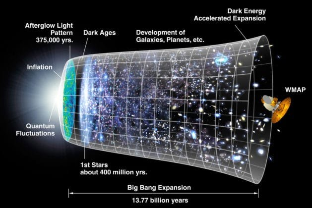
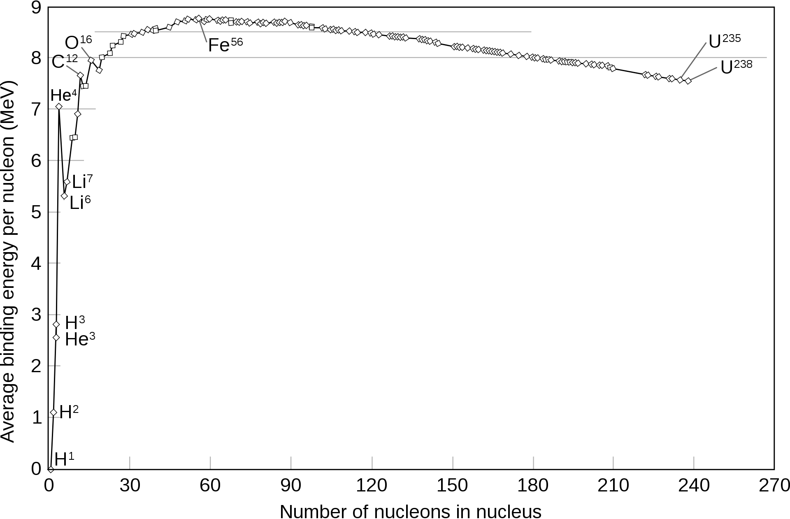

# Principles of Cosmic Life and the Genesis of Life

The biological aspects are the vertical axis of the Model of Biodanza. 
At the bottom of the model, we first encounter the Principles of Cosmic Life and the Genesis of Life, which are indicate with the red box in Figure \@ref(fig:modelCosmic). 

```{r modelCosmic, fig.cap='Model of Biodanza and Principles of Cosmic Life and the Genesis of Life', out.width='50%', fig.asp=.8, fig.align='center', echo=FALSE}
knitr::include_graphics("./figs/biologischeAspectenBiodanzaDeelI.png")
```

We will start with the genesis of the universe and we conclude with the genesis of life^[Here life has the meaning of biological life and not the more broad view that Rolando has on life]. These two sections cover the concepts in the reader for Module IV Biological aspects of Biodanza on these topics. 

## Genesis of Universe

An overview of the evolution of our universe is given in Figure \@ref(fig:evolutionUniverse).

```{r evolutionUniverse, fig.cap='Genesis and Evolution of our Universe (Source: NASA/WMAP Science Team, Wikipedia)', out.width='100%', fig.asp=.8, fig.align='center', echo=FALSE}

```

The most common theory is that our cosmos started with the Big Bang. 
A very energy-rich state.  

By expanding the universe quickly cooled down enough for energy to be converted into mass, i.e. the majority in hydrogen and a fraction in more heavy helium nuclei. 


### Genesis of Stars

Under the influence of the gravitational force, matter then started to cluster in nebula, gaseous clouds essentially consisting of hydrogen (H) and helium (He). 

Due to concentration difference in these first nebula, these clouds further contracted and eventually imploded (See Figure \@ref(fig:genesisStar)). 

```{r genesisStar, fig.cap='Genesis of the first stars (Source: universe-review.ca)', out.width='100%', fig.asp=.8, fig.align='center', echo=FALSE}
#knitr::include_graphics("https://universe-review.ca/I08-13-firststars6.jpg")
knitr::include_graphics("./figs/I08-13-firststars6.jpeg")
```


Extreme heating in the nebula that imploded by gravity gave rise to a condition in which all matter was in the form of a super hot plasma.
In such a plasma nuclear fusion spontaneously takes place. In this process light atoms are combined into more heavy atoms and much energy is released.

First all hydrogen atoms are converted into helium (see Figure \@ref(fig:nuclearFusion)). The mass of the resulting Helium nuclei is slightly lower than that of the original hydrogen nuclei and the mass difference has been converted into energy. 

```{r nuclearFusion, fig.cap='Nuclear Fusion of hydrogen to the more heavy helium (Source: Sarang, Wikipedia)', out.width='50%', fig.asp=.8, fig.align='center', echo=FALSE}
knitr::include_graphics("./figs/fusion.svg")
```

If all hydrogen in a star is used, the fusion stops because the activation energy to convert helium to lithium is too high (Figure \@ref(fig:fusionEnergy)).

```{r fusionEnergy, fig.cap='Energy liberated by nuclear fusion. In a star nuclear fusion happens until Iron (Source: Wikipedia)', out.width='50%', fig.asp=.8, fig.align='center', echo=FALSE}

```

Therefore, the star cools down, implodes, which causes a sudden increase in heat. This allows the activation energy of helium to lithium to be exceeded and the spontaneous nuclear fusion of the heavier elements upto iron (Figure \@ref(fig:fusionEnergy)). This releases so much energy that the star explodes into a supernova (see Figure \@ref(fig:supernova)). During the supernova nuclear fusion further occurs and these newly formed elements are projected in the universe.

```{r supernova, fig.cap='Supernova of a star (Source:  www.universetoday.com)', out.width='50%', fig.asp=.8, fig.align='center', echo=FALSE}
#knitr::include_graphics("https://www.universetoday.com/wp-content/uploads/2020/04/hires.jpg")
knitr::include_graphics("./figs/hires.jpeg")
```

A supernova gives rise to new nebula and these will eventually lead to new stars and the whole process begins all over. 

Hence, through nuclear fusion in the stars the more heavy atoms have been generated of which the bio-molecules of life are eventually built. So we are built out of cosmic dust! 

\newpage 

### Carbohydrates in Interstellar Space

Upon nuclear fusion in the stars many different elements are formed. For biological life, hydrogen, carbon, oxygen, sulfur, phosphorous and nitrogen atoms, among others, are key to compose organic matter. 

In interstellar space, carbon reacts spontaneously with other elements to form poly-aromatic carbohydrates  (PAHs). This is for instance visible in a photograph of the Cat's paw nebula (Figure \@ref(fig:catPawNebula)). In the green regions radiation of hot stars induces fluorescence of PAHs. 

```{r catPawNebula, fig.cap='Cat\'s Paw nebula, in the green regions radiation of hot stars induces fluorescence of PAHs (Source: NASA/JPL-Caltech, Wikipedia)', out.width='50%', fig.asp=.8, fig.align='center', echo=FALSE}
knitr::include_graphics("./figs/orionWithPAH.jpeg")
```    

PAHs were already be generated shortly after the Big Bang.  Once they are produced, they are further transformed in interstellar space upon reaction with hydrogen and oxygen <!-- via hydrogenation (reaction with hydrogen), oxygenation (reaction with oxygen) --> among others to form precursor molecules ("forerunners") for amino acids and nucleotides, which are the building blocks of proteins, and, of RNA and DNA, respectively. So these simple building blocks that are essential for the chemistry of life are already omnipresent in space. 

This, among other arguments, let Christian de Duve to formulate his quote that "Life is an obligatory manifestation of matter, written into the fabric of the universe" [@deDuve2002].  


## Genesis of Life 

In a remote corner of our milky way, which is an average galaxy, an average planet was formed, which we know as our planet Earth. 
After the Earth cooled down liquid water was formed. The unique features of liquid water are essential for life as we know it.
Indeed, once liquid water was available, biological life emerged in less than 300 million years, which is very short time interval on the geological timescale. 

<!-- Water is a peculiar molecule and it has the unique feature to form hydrogen bounds between the hydrogen and oxygen atoms of different molecules (see Figure \@ref(fig:water)). 

```{r water, fig.cap='Structure of water. A unique feature of water is that it forms hydrogen bounds indicated by (1) (Source: Wikipedia)', out.width='25%', fig.asp=.8, fig.align='center', echo=FALSE}
knitr::include_graphics("./figs/3D_model_hydrogen_bonds_in_water.svg")
```    

These hydrogen bounds cause water to be liquid at higher temperatures than what we would expect based on the small size of the molecule. It also makes water to freeze with volume increase! Water has its lowest volume while it is liquid at 4°C. -->


So on earth conditions emerged that made the *"genesis of life"* as we know it, possible. The exact process that led to the life forms on earth is unknown and will probably remain so. 
However, a general rationale is displayed in Figure \@ref(fig:originOfLife).

```{r originOfLife, fig.cap='Stages in the origin of life range from well-understood, such as the abiotic synthesis of simple organic molecules, to largely unknown, like the origin of the last universal common ancestor (LUCA) with its complex molecular functionalities. (Source: Chiswick Chap, Wikipedia)', out.width='100%', fig.asp=.8, fig.align='center', echo=FALSE}
knitr::include_graphics("./figs/origin_of_life_stages.svg")
```  

First, a chemical evolutionary process gave rise to organic molecules with increasing complexity. It is a general consensus that RNA molecules emerged first from free nucleotides. RNA molecules are known to be catalytic and are carriers of genetic information. They can also replicate themselves under anoxic conditions (in the absence of oxygen) and in the presence of iron, conditions that occurred at young planet Earth (e.g. @Williams2013). These RNA molecules evolved either alone, the RNA-world hypothesis, or already in conjunction with proteins.  

Next, it is assumed that prebiotic molecules, which could self-replicate, were encapsulated by phospholipids, which spontaneously form membrane like structures. This resulted in a protocell with a membrane (see Figure \@ref(fig:originOfLife)).
In these protocells a further chemical evolution was possible, separated from the environment, which ultimately led to a self-replicating and self-organizing cell that was built from the four essential type of bio-molecules of life: lipids, carbohydrates, proteins and nucleic acids. 

Further biological evolution of these first living cells eventually gave rise to our last universal common ancestor (LUCA).
LUCA must have had at least 355 genes, which all living organisms have in common.
LUCA was anaerobic, living without oxygen, and maintained its hereditary material using DNA, the genetic code, and produced proteins from RNA templates in ribosomes. LUCA retrieved its energy from oceanic volcanic activity in deep sea vents, i.e. the intensely hot plumes caused by seawater interacting with magma erupting through the ocean floor. And eventually LUCA evolved into all species that currently live on Earth. 


Now, that we introduced the genesis of life, we can focus on the tale of the evolution of LUCA into all species of the tree of life, a process which is also referred to as phylogenesis.  
