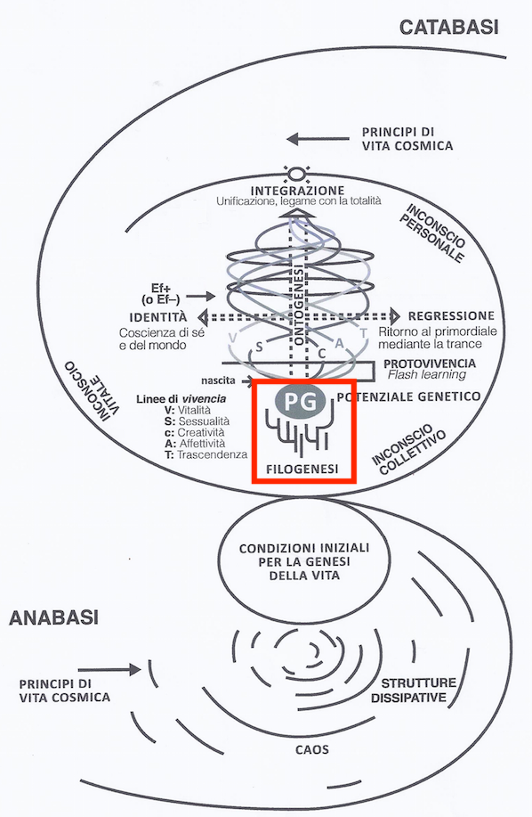
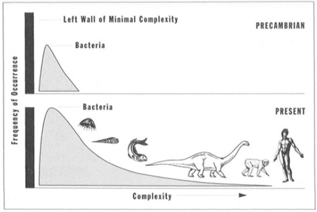

# Phylogenesis and Evolution

In the middle of the model, we see the biological aspect "phylogenesis" indicated with the red box in Figure \@ref(fig:modelPhylo), which forms our focus in this chapter.  

```{r modelPhylo, fig.cap='Model of Biodanza and Phylogenesis', out.width='50%', fig.asp=.8, fig.align='center', echo=FALSE}

```


## Phylogenesis

All species evolved from the same ancestral population of cells. 
This is also referred to as the same Last Universal Common Ancestor (LUCA). 
In the tree of life the evolutionary relations are summarized between different organisms (and groups of organisms). All living beings eventually can be traced back to the last universal common ancestor who is located at the root of the tree, see Figure \@ref(fig:treeOfLifeBis).

```{r treeOfLifeBis, fig.cap='The tree of life is one of the most important organizing principles in biology. It shows the evolutionary relationships among different organisms and that all living beings eventually can be traced back to the last universal common ancestor who is located at the root of the tree (Source: wikipedia)', out.width='100%', fig.asp=.8, fig.align='center', echo=FALSE}
knitr::include_graphics("./figs/Phylogenetic_tree.svg")
```

Phylogenesis is the process of the origin of all species from the tree of life from LUCA. 

Rolando Toro refers to the origin of species and adaptation to the environment as evolutionary differentiation. 


### Timescale

<!--  -->


| 4.5 BYA | 4.3 BYA | 3.8 BYA | 3.5 BYA | 540 MYA | 520 MYA |
|---------|---------|---------|---------|---------|---------|
|         |         |         |         |         |         |

(Source: naturedocumetaries.org)


At its origin about 4.5 Billion Years Ago (BYA) the Earth was black, a hot basalt rock and dust in a cold vacuum. 
As the Earth cooled down she became Grey Earth (4.3 BYA) as she was mainly covered by granite and rocks. Another 500 million years later she was covered with liquid water: Blue Earth (3.8 BYA). 

In only 300 million years she radically changed into Red Earth (3.5 BYA) due to life. Indeed, cyanobacteria emerged that can do photosynthesis and produce oxygen, a very reactive molecule. This led all free iron in the ocean to precipitate as iron oxide or rust (red). There was an explosion of the number of minerals, they went from approximately 250 to more than 5000 mineral species. Oxygen also caused a mass extinction because only few organisms could cope with its highly reactive nature. The coming 3 billion years life on Earth stayed relatively similar.  
  
Around 540 MYA Earth was struck by a large ice age, White Earth. 
Again leading to a mass extinction due to the cold. However,  volcanic activity came to the rescue by producing greenhouse gasses and an atmosphere that could retain more heat. 

In less than 20 million years (MY) Earth radically changed again and turned into Green Earth (520 MYA). In only 20 MY there was an explosion of life, and life suddenly evolved from unicellular to more complex multicellular forms. 

### Change Point: Genesis of Eukaryotic Cells

The change point that made the origin of multicellular species possible was the genesis of eukaryotic cells. 

There are two archetypes of cells: 

- Prokaryota, simple cells of a size of  0.1 to 5.0 $\mu m$ with DNA that is lying freely in the cell cytosol (the fluid in the cell), see Figure \@ref(fig:prokaryotaCell) and 

```{r prokaryotaCell, fig.cap='Diagram of a typical prokaryotic cell. The cell is simple, the DNA is lying free in the cell (Source: Ali Zifan, Wikipedia)', out.width='50%', fig.asp=.8, fig.align='center', echo=FALSE}
knitr::include_graphics("./figs/prokaryoteCell.svg")
```

- Eukaryota are larger and more complex cells, 10-100 $\mu m$ in size. They have a variety of internal membrane-bound structures, called organelles, and a cytoskeleton, which play an important role in defining the cell's organization and shape. Eukaryotic DNA is stored in chromosomes, that are located in the cell nucleus, which is the organelle maintaining the integrity of genes and controlling the activities of the cell by regulating gene expression. The nucleus can, therefore, be viewed as the control center of the cell, see \@ref(fig:animalCell) and \@ref(fig:plantCell).


```{r animalCell, fig.cap='Diagram of a typical animal cell. Animal cells are eukaryotic cells. They are typically much larger than those of prokaryotas. They have a variety of internal membrane-bound structures, called organelles, and a cytoskeleton, which play an important role in defining the cell\'s organization and shape. Eukaryotic DNA is divided into chromosomes, that are located in the cell nucleus, which is the organelle maintaining the integrity of genes and controlling the activities of the cell by regulating gene expression. (Source: Mariana Ruiz Villarreal, Wikipedia)', out.width='50%', fig.asp=.8, fig.align='center', echo=FALSE}
knitr::include_graphics("./figs/animalCell.svg")
```

```{r plantCell, fig.cap='Diagram of a typical plant cell. Animal cells are eukaryotic cells. They are typically much larger than those of prokaryotas. They have a variety of internal membrane-bound structures, called organelles, and a cytoskeleton, which play an important role in defining the cell\'s organization and shape. Eukaryotic DNA is divided into chromosomes, that are located in the cell nucleus, which is the organelle maintaining the integrity of genes and controlling the activities of the cell by regulating gene expression. Plant cells also have a cell wall and chloroplasts that can perform photosynthesis. (Source: Mariana Ruiz Villarreal, Wikipedia)', out.width='50%', fig.asp=.8, fig.align='center', echo=FALSE}
knitr::include_graphics("./figs/plantCell.svg")
```


From 3.5 BYA - 520 MYA we only find prokaryota cells in fossils.
Eukaryotic cells are believed to be generated by endosymbiosis, i.e. a symbiotic relationship where one organism lives inside the other, which is beneficial for both organisms.

The process of endosymbiosis that led to eukaryotic cells is displayed in Figure \@ref(fig:endosymbiosis). 

```{r endosymbiosis, fig.cap='Genesis of eukaryotic cells (Source: wikipedia)', out.width='80%', fig.asp=.8, fig.align='center', echo=FALSE}
knitr::include_graphics("./figs/endosymbiosis.svg")
```
First a prokaryotic cell is assumed to grow and to generate membrane systems inside the cell, which gave rise to the formation of the nucleus. At a certain point of time a proteobacterium that could use oxygen for respiration must have been ingested, which managed to avoid digestion. The two cells started with an endosymbiotic relation. 

The proteobacterium provided the cell with additional energy and the host cell fed the proteobacterium with nutrients. This gave the endosymbiotic pair to ability to grow further in size and to thrive in the oxygen rich environment of planet Earth. 

The proteobacterium gradually handed over a number of its genes to the cell nucleus, and became under regulation of the nucleus.  It eventually evolved to mitochondria, the organelles that are the energy plants of a cell. So, we inherit more from mother than father: we inherit our cell structure and energy system from mother side through her egg cell.

In plant cells, a second endosymbiotic event must have occurred with eukaryotic cells and cyanobacteria. The cyanobacteria then evolved in a similar way into chloroplasts, which give plants the ability for photosynthesis and led them become the most successful life form of the globe.


Other key differences between Prokaryota and Eukaryota are in terms of their reproduction. 
For Prokaryota that only takes place by cell division. A mutation in the DNA is thus fixed in all daughter cells. While nearly all Eukaryota have a phase of sexual reproduction. They are diploid organisms, i.e. they have two copies of each gene, one from fathers' and mothers' side. This enables successive mutations to be made in one copy because another functional copy of the gene is available. Moreover during sexual reproduction recombination of chromosomes occurs, i.e. reshuffling of paternal and maternal genes, which leads to much more variation. 
  
The Eukaryota further evolved in protists, which are unicellular organisms, fungae, plants and animals.

\newpage 

## Evolution

How thus the evolution of LUCA to all species of the tree of life occurred? 
Evolution is largely driven by variability and selection. 

### Variability and Selection

Variation occurs, among others, through errors in the copying of DNA for cell division of prokaryotic cells and gamete production for eukaryotic cells (see Figure \@ref(fig:dnaPolymerase)). 

```{r dnaPolymerase, fig.cap='Copying of DNA by DNA-polymerase. DNA polymerase extends a DNA strand by incorporating a complementary nucleoside-tri-phosphate and splitting two of the three phosphate groups  (Note again the link between energy and information). Errors are often corrected by proofreading. However, some of the errors remain.', out.width='45%', fig.asp=.8, fig.align='center', echo=FALSE}
knitr::include_graphics("./figs/DNA_polymerase.svg")
```

</br> 

The error margin of DNA replication is 1 error per billion base pairs that are copied, which can lead to point mutations.  Note, that we humans have a genome size of about 6.4 billion base pairs.

Other sources of variability are

- Insertions or deletions, i.e. base pairs that are added or removed, respectively. 
- Recombination, reshuffling of genetic traits, e.g. during sexual reproduction 


Most mutations are neutral, i.e. the mutated codon encodes for the same amino acid. Neutral mutations can be used as a molecular/genetic clock to tell how far apart two species are in an evolutionary sense. 

But, mutations are not always neutral! For instance, sickle cell anemia is caused by one point mutation in hemoglobin (see Figure \@ref(fig:sickleCell1) and \@ref(fig:sickleCell2)). A thymine is mutated to an adenine, which results in a codon that encodes for the amino acid valine instead of glutamic acid. This causes dramatic changes to the 3D structure of the hemoglobin protein and causes a deformation of the red blood cells from a round to sickle shape,  which leads to anemia.   

Why does this mutation remain? It mainly occurs in Africa because sickle cell anemia also makes affected individuals resistant against malaria, which gives them a evolutionary competitive advantage despite their anemia. However, offspring that inherits the mutation of both parents is not viable. 
 
```{r sickleCell1,  fig.cap='Mutation of Hemoglobin in patients with sickle cell anemia (Source: Wikipedia)', out.width='45%', fig.asp=.8, fig.align='center', echo=FALSE}
knitr::include_graphics("./figs/sickleCellWikipedia2.png")
```

```{r sickleCell2,  fig.cap='Deformed red blood cells in patients with sickle cell anemia (Source: Wikipedia)', out.width='45%', fig.asp=.8, fig.align='center', echo=FALSE}
knitr::include_graphics("./figs/Sickle_Cell_Anemia_wiki3.png")
```


### Evolution


Evolution is a natural process that forms the basis of the origin of species (bacteria, fungi, plants, animals).

It is driven by two opposing forces: variation and selection

Variation occurs by spontaneous copy errors in genetic code or  mutations, among others. 

Selection occurs upon ecofactors. Is a mutation beneficial or harmful for a particular organism in its specific environment.
The odds on fixation of the mutation thus depends on the reproductive success. 

The process of genetic variation and selection can eventually lead to new species upon many generations. 


### Genetic Drift 

Another important process for the origin of species is genetic drift. This are random fluctuations of alleles, which are particular sequence variants of a gene. Genetic drift is particularly strong in small populations. As opposed to selection it is not adaptive. 

New species will thus originate more quickly when a small fraction of the population gets isolated in a new environment. 


### Horizontal Gene Transfer 

A last process that introduces variation is horizontal gene transfer, in example non-sexual transfer of genetic information between two distinct organisms.  

This is very common between Prokaryota, i.e. eubacteria and archaea bacteria, think on the super bugs in hospitals that acquired resistance to multiple antibiotics. It also occurs between Eukaryota. Mainly in protists, which are unicellular organisms with a nucleus. As well as between Prokaryota on the one hand and Eukaryota on the other hand. 

### Teleonomy

The term teleonomy means that evolution only has the primitive goal to maintain and reproduce the species, and, that it thus has no purpose or direction. 

When complex organs and organisms originate it might seem as if there is a direction or purpose, but, that is not the case! A good example is the development of an eye, see Figure \@ref(fig:evolutionEye). 

```{r evolutionEye,  fig.cap='The evolution of an eye (Source: Wikipedia)', out.width='45%', fig.asp=.8, fig.align='center', echo=FALSE}
knitr::include_graphics("./figs/evolutionEye.png")
```

Indeed, 

- The eye is not developed by evolution with the purpose to see. 

- The eye only has the function to see.

- It is the result of a gradual process where each adaptation gave a reproductive advantage in a particular environment. 

- In another environment it can be no longer functional and than it might disappear or might become dysfunctional, e.g. moles eyes.
    
Hence, the origin of a species is the result of evolution, but, not the purpose of evolution.  Evolution is thus adaptation with as sole goal maintenance and reproduction. 

From the distribution of the complexity of species in Figure \@ref(fig:distributionComplexity), it is clear that the most abundant species in number always has been bacteria. 
Indeed, evolution has no direction.
The distribution of complexity at present, however, has a tail to the right.
This mainly stems from the fact that there is lower bound of complexity of living organisms. Hence, evolution could not generate organisms with a complexity below this lower bound and it therefore only seems as if it slightly favors increasing complexity. 

(ref:gould) Distribution of complexity of species [@gould1997]

```{r distributionComplexity,  fig.cap='(ref:gould)', out.width='45%', fig.asp=.8, fig.align='center', echo=FALSE}

```
  
  
@Bar-On2018 published the distribution of carbon mass fixated in different types of species in Figure \@ref(fig:carbonFixated), which also shows that there is no preference towards more complex organisms.

(ref:carbonFixatedCap) Mass in giga tons of carbon for different groups of species. [@Bar-On2018]

```{r carbonFixated,  fig.cap='(ref:carbonFixatedCap)', out.width='100%', fig.asp=.8, fig.align='center', echo=FALSE}
#knitr::include_graphics("https://www.pnas.org/cms/10.1073/pnas.1711842115/asset/44253c25-afd5-4fa1-b060-31591f934f5d/assets/graphic/pnas.1711842115fig01.jpeg")
knitr::include_graphics("./figs/pnas.1711842115fig01.jpg")
```


Note, that 

- Plants are the most successful group in terms of the mass of carbon that they fixate. 

- Bacteria clearly dominate the more complex animal kingdom.

- Animals represent a relative small fraction. Among animals, cattle and humans are over represented. 

Other compelling evidence that there is no direction to evolution stems from the number of bacterial cells in our body. @Sender2016 showed that the ratio of the number of bacterial cells to the number of human cells is close to 1. A human with a weight of 70kg has $\pm$ 38 trillion bacterial cells and 30 trillion humane cells. Note, that trillion is a thousand billion or 10$^{12}$!

So, all these examples make clear that evolution has no direction. For every organism with a higher complexity there also emerge many organisms with lower complexity! 

## Evolution of Evolution

First there was 

1. Chemical evolution: the selection of building blocks and complex chemistry. 
2. Then, biological evolution of cells/organisms based on the selection of genetic information and function.
3. And finally, our species  introduced cultural evolution that can bypass natural evolution using
    
    - artificial selection: breeding of plants, pets, cattle, genetic manipulation, etc.
    - Technology: that enables us for a fast adaptation to new environments

As a final remark, Rolando Toro also shared the view that the genetic information of a species can be seen as a record of the environments and development that it underwent up to this point. 

Now that we introduce how all species could evolve from their last universal common ancestor we are ready to make the transition to how we humans evolves in our life span. This is also referred to as ontology, which is a another crucial biological aspect in the Model of Biodanza, which is our focus in the next chapter.