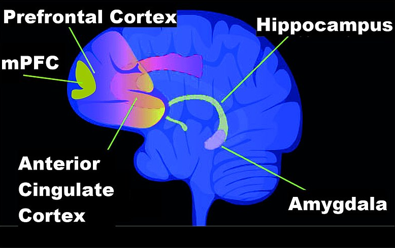

# Ontogenesis

In the upper part of the model, we see the biological aspect "ontogenesis" indicated with the red box in Figure \@ref(fig:modelOnto), which is our focus in this chapter.  

```{r modelOnto, fig.cap='Model of Biodanza and Ontogenesis', out.width='50%', fig.asp=.8, fig.align='center', echo=FALSE}
knitr::include_graphics("./figs/biologischeAspectenBiodanzaDeelIII.png")
```


The ontogenesis is the development of an organism from a fertilized egg cell up to the adult stage until we eventually die. 

Our ontogenesis starts from the genetic potential we inherit from our parents through their egg and sperm cell. The fertilized egg cell then starts to divide and at a certain point the cells start to differentiate into different tissues.
Each of our cells, apart from our germ cells, has the same genetic material! 

Another very important factor in our development is our environment and how we interact with our environment. 
Indeed, our phenotype, i.e. our observable traits and characteristics, stem from the complex interplay between our genomic makeup, our genotype, and environmental factors.

Key questions that arise in this respect is how cells of different tissues of the same organism that share the same genetic code can be morphologically so distinct, and how the environment and changes in our environment can impact our phenotype? 

This is due to epigenetics! And, epigenetics was the missing link that Rolando Toro needed to explain how Biodanza can provide an enriched environment that induces organic and cellular renewal, affective re-education and relearning of the original functions of life. A very compelling hypothesis, which he formulated at the end of his life. 

In this chapter, I introduce the concept of epigenetics and I will discuss references in the scientific literature that can help us to understand the rationale of Rolando's hypothesis. Note, however, that we cannot interpret these references as scientific proof for the role of epigenetics in Biodanza, as epigenetics effects of Biodanza have not been studied experimentally, yet. 

## Epigenetics

Epigenetics is the study of how development, behavior and environment can cause changes that affect the way we use our genes. Unlike genetic changes, epigenetic changes do not change our DNA sequence, but they can change how our body can (or cannot) read our genes.

Epi means "on top of" and genetics, our genes. And that is literally what it means: a set of instructions that sits on top of our genes.  Epigenetics acts through epigenetic markers, small molecules that interact with our DNA. These markers can make genes accessible or inaccessible for the cell.

Epigenetics has a large impact on our biology. Our brain and muscle cells for instance have the same DNA, but they are completely different in shape and function (see Figure \@ref(fig:brainMuscle)). This is because they use an entirely different set of genes. The difference in the genes they express are determined to a large extent by differences in their epigenome, i.e. the entire collection of epigenetics marks across their entire genome^[all the genetic information or DNA of a cell or an organism]. Remarkably these epigenetic markers are also copied when a cell divides, so brain cells therefore remain brain cells and muscle cells remain muscle cells upon cell division.  

```{r brainMuscle, fig.cap='Brain (left) and muscle cells (right) (Wikipedia: BrainsRusDC, left and Nephron, right).', out.width='90%', fig.asp=.8, fig.align='center', echo=FALSE ,fig.show='hold'}
knitr::include_graphics(c("./figs/brainMuscleCells.png"))
```

The major epigenetic changes occur during embryonic development. In a fertilized egg cell all our genes are more or less accessible. However, as the embryo develops, cells differentiate into brain cells, muscle cells, nerve cells, liver cells etc. This differentiation happens through the addition or removal of epigenetic marks, and this is triggered by differences in the hormone concentration throughout the embryo and by the signals that a cell receives from its neighboring cells.

This brings us to a very important point of epigenetics: epigenetics is largely influenced by the environment. Not only the neighboring cells have an impact on the developing embryo, but also mother's food, smoking behavior and stress levels among others, that are passed through her bloodstream to the developing fetus and have an epigenetic impact that will determine how the fetus will use their genes in their adult life. Even more interesting for Biodanza is that the epigenetic process continuous after birth. This is particularly so for our brains that keep on growing and developing throughout our lives, and again the interaction with our environment is key.

In rats, for instance, maternal grooming and nursing behavior has been shown to have a major impact on the  so-called "hypothalamic–pituitary–adrenal (HPA) stress and defensive response of adult rats [@Meaney2004]. Well nurtured adult rats behave less fearful under conditions of stress and have a more active exploratory behavior when they are placed in novel environments. This through their epigenome of the glucocorticoid receptor (GR) in the hippocampus that is affected by their mother-pup contact in the first week of their lives. The epigenome of the well nurtured rats enables higher expression levels of the GR in their adult life, which is known to dampen their HPA stress response [@Meaney2004;  @Meaney2005]. Interestingly, these findings have been translated to humans, where similar effects on the GR epigenome were observed in post-mortem human adult brain tissue between people that had a normal childhood and people with a history of child abuse [@Meaney2009]. The authors also showed in rats that these epigenetic marks established early in life through behavioral programming, were reversible in the adult brain [@Meaney2005]. 

Importantly, for Biodanza, there is also growing evidence on the pivotal role of epigenetics for learning and on how we can impact the expression of our genes with our life-style through epigenetics. 
Studies on rodents for instance pinpointed the importance of an enriched environment, with increased levels of multisensory stimulation, physical activity and social interactions, on neuroplasticity^[neuroplasticity is the ability of the nervous system to change its activity in response to intrinsic or extrinsic stimuli by reorganizing its structure, functions, or connections after injuries] [@baroncelli2010]. Interestingly, an enriched environment has also been shown to reduce hippocampal oxidative stress and inflammation [@grinan2016] and to preserve a young epigenetic landscape in the aged mouse hippocampus^[The hippocampus is an important component of the brain. It has a major role in learning and memory consolidation] [@zocher2021]. 
In human twins study an association has been found between physical exercise and epigenetic markers that are linked to a reduced development of metabolic syndrome [@Duncan2022]. These epigenetic alterations, were associated with genes that are known to be involved with physical activity and obesity. Interestingly, @BlackburnEpel2017 also discuss studies where it was shown that mind-body techniques such as meditation, qigong and yoga, among others are stress reducing, have positive effects on our well-being, can prevent inflammation and can induce cell rejuvenation by (re-)activating important genes for cell and tissue restoration and regeneration. These effects were observed in well designed experiments and are in line with the beneficial effects that Rolando Toro also envisioned to induce through his System of Biodanza, among others. 

In the remainder of this chapter, we will dive deeper in the fascinating realm of epigenetics. We will introduce epigenetic markers and illustrate the role of epigenetics in embryonic development, learning, ageing and stress.

## Epigenetic markers


Epigenetic markers are small molecules that interact either directly with the DNA or with histones, which are specific proteins that act as spools that wind the long DNA molecule in a more compact/condense form (see Figure \@ref(fig:epigenetics)). 
They can make genes accessible or inaccessible for RNA transcription and thus eventually for the production of proteins. Two common types are 

- DNA methylation: binding a methyl group directly to DNA^[A methyl group (-CH$_3$) consists of one carbon and three hydrogen atoms].
- Histone acetylation: binding an acetyl group to histone proteins^[An acetyl group (-CO-CH$_3$) consists of two carbon, one oxygen and three hydrogen atoms].

```{r epigenetics, fig.cap='Principes of epigenetics. Small molecules, epigenetic markers, interact with the DNA and histones. They can cause a gene to be accessible or inaccessible for RNA transcription (Source: NIH, Wikipedia)', out.width='100%', fig.asp=.8, fig.align='center', echo=FALSE}
knitr::include_graphics("./figs/Epigenetic_mechanisms.png")
```
<!-- Note, that binding a molecule on a protein after translation is also referred to as post translational modification (PTM). --> 

Both types can impact the activity of genes.
On the one hand DNA methylation actively represses the expression of a specific gene, while DNA demethylation enhances gene expression. 
On the other hand histone acetylation makes the structure of a region of DNA more open and thus more accessible for transcription of the genes in that region, while de-acetylation has the opposite effect.  

## Epigenetics during Embryonal Development

Epigenetics plays an important role in embryonic development (see Figure \@ref(fig:epiEmbryo)). 

(ref:epiEmbryoLab) Epigenetics in embryo genesis at CpG islands, regions that can bind with many methyl groups. All CpG islands of a sperm cell are almost fully methylated. That of an egg cell are methylated around 50%. Upon fertilization the methylation drops and almost all genes become accessible for the undifferentiated blastula. As cells differentiate and get specific functions in tissues methylation increases again (Source: Mariuswalter, Wikipedia)

```{r epiEmbryo, fig.cap='(ref:epiEmbryoLab)', out.width='100%', fig.asp=.8, fig.align='center', echo=FALSE}
knitr::include_graphics("./figs/DNA_methylation_reprogramming.png")
```

CpG islands are regions in our DNA that can be heavily methylated. They are major regulatory units and around 70% of our genes have CpG islands in their promotor regions^[A promoter is a sequence of DNA to which proteins bind to initiate transcription of the gene downstream of the promotor]. Methylation of the promotor region is typically associated with a reduction of gene expression. In Figure \@ref(fig:epiEmbryo) we observe that the CpG islands of a sperm cell are almost fully methylated, which indicates that many genes are likely to be silenced. The CpG islands of an egg cell are methylated around 50%. Upon fertilization the methylation drops in the blastocyst (an early stage of embryonic development, about five days upon fertilization). This is required for the cells to regain the property that they can divide and differentiate to all cell-types of the developing organism. As differentiation of the cells starts and as they evolve into tissues, methylation increases again so that the cells have access to less genes and get more specific functions. Note, that the methylation status is also passed upon cell division, which leads to invariance of differentiated cells: indeed, a muscle cell remains a muscle cell upon division and a brain cell a brain cell, etc.   


## Epigenetics and Learning

This section is largely based on the review article of Creighton et al. entitled "Epigenetic Mechanisms of Learning and Memory: Implications for Ageing"  [@Creighton2020].

In the last decade, it has been shown that epigenetics is very important in development of the brain and for learning. 

Animal research has shown that the disruption and inhibition of gene expression and translation in the brain shortly after a learning event, has a tremendous impact on long time memories ($\geq 24$ hours), but not on short term memories. These manipulation had most impact in the first hours upon the learning event. Suggesting that the initial memory consolidation happens within a 6 hour time window. 

Learning typically happens in waves. Genes activated shortly after learning return to baseline within 24 hours, a time point at which a second wave of gene expression is triggered. 
In the second wave, genes are included that encode for epigenetic regulators. 
So, the first wave within 6 hours upon learning is known to up regulate transcription factors important to initiate the second wave of transcription, which is needed to establish long-lasting memories. 

<!--Understanding memory consolidation gets even more complex due to the reorganization of neural networks associated with recent memory storage and later memory phases ($>7$ days).-->

### DNA Methylation and Memory

In a large number of studies, DNA methylation has been shown to play an important role in multiple stages of memory formation. 

On the one hand it is shown that DNA methylation is transient, i.e. rapidly induced and reversed in the first hours upon learning. On the other hand, stably altered cortical DNA methylation has been shown up to 4 weeks upon learning and blocking the cortical DNA methylations has been shown to impair memory.
So methylation plays a role in different stages of the process of memory formation. 

It also has been shown that methylation influences memory through different mechanisms, e.g. 

- Regulation of the activity of enhancers, i.e. short DNA regions that enhance the transcription of genes
- Alternative splicing, i.e. transcribed RNA from a gene region is spliced by which certain exons, i.e. coding stretches, are removed, resulting in the production of different gene products from the same gene. So methylation can change the specific gene products that are transcribed from a particular gene.
- Expression of micro RNAs, short non-coding RNAs, that are biologically active. 

A large body of literature support the role of methylation in learning and it is shown that methylation associated to learning occurs in the hippocampus, prefrontal cortex and the amygdala of the brain (Figure \@ref(fig:brainRegionsLearning)).

```{r brainRegionsLearning, fig.cap='Brain regions involved in memory formation. (Source: Wikipedia)', out.width='50%', fig.asp=.8, fig.align='center', echo=FALSE}

```


### Histone Modifications and Memory

Another type of epigenetic regulation is through the modification of histones, i.e. the proteins that act as spools around which the long DNA molecule is winded and which can affect the accessibility of a DNA region upon modification. 

Histone modifications with epigenetic markers have been shown to be mainly important in the initial phase of memory consolidation. They are rapidly modified after which they return to baseline. These modifications cause "unwinding or winding the DNA from or around the histones" making particular genes accessible or inaccessible for expression. 

Histone epigenetic markers seem to regulate the transcriptional sensitivity towards external stimuli. Histone acetylation that makes the DNA more accessible, for instance, has been shown to increase learning induced gene expression and seem to be particularly important for regulating memory strength. 

So recent progress has shown the tremendous importance of epigenetics for brain development and learning, however, the field of neuro-epigenetics is still in its infancy and many open questions remain.  

## Epigenetics and Aging

Epigenetics are also largely driven by ecofactors. This can be nicely illustrated with identical twins who have almost the same genome^[Identical twins have almost exactly the same genome, only very small differences have been build up in the womb]. It gets more easy to tell them apart over time due to epigenetic changes that are triggered by the different environments to which they were exposed and that effectively changed how they are using their genes. A good example is the difference in skin ageing between twins that had a different exposure to UV radiation (e.g. Figure \@ref(fig:epiUV)). 

(ref:epiUVlab) Difference in skin ageing between twins is largely induced by epigenetic changes originating from a difference in exposure to UV radiation [@Schwab2017]

```{r epiUV, fig.cap='(ref:epiUVlab)', out.width='50%', fig.asp=.8, fig.align='center', echo=FALSE}
#knitr::include_graphics("https://www.researchgate.net/profile/Tara-Hogenson/publication/320386487/figure/fig1/AS:783847914471429@1563895314907/dentical-twins-with-phenotypic-discordance-due-to-environmental-exposure-Although-MZ.png")
knitr::include_graphics("./figs/dentical-twins-with-phenotypic-discordance-due-to-environmental-exposure-Although-MZ.png")
```

Another twins study showed an association between physical exercise and epigenetic markers associated with a reduced development of metabolic syndrome [@Duncan2022]. Indeed, by studying identical twins with one person that was physical more active than the other member of the twin, the researchers minimized the genetic differences between active and inactive participants in the study. This setup allowed them to discover regions that were differentially methylated between active and inactive participants, while controlling for their genetic make-up. The methylation alterations that were found were associated with genes that are known to be involved with physical activity and obesity. 

Aging and longevity are influenced by genetic, epigenetic, and environmental factors during development, growth, maturity, and older stages.
It has been shown that the genetic component (heritability) plays only a moderate role in aging and longevity, so epigenetics seems to be a major contributor [@Adwan2018]. Indeed, many epigenetics markers and in particularly DNA methylation sites have been shown to be remarkable predictors of chronological age. 
Aging has been shown to be associated
with profound changes in the epigenetic landscape, that give rise to alterations of gene expression and genome architecture. 

An important modes of action in ageing has been shown to be through the association of epigenetics and telomere length. 

Telomeres are regions of repetitive nucleotide sequences associated with specialized proteins at the ends of our chromosomes, see Figure \@ref(fig:telomeres). Each cell division the telomeres get shorter and the telomere shortening has been associated with ageing of cells, tissues and organs. 

```{r telomeres, fig.cap='Telomeres are repetitive nucleotide sequences at the end of a chromosome. Each time a cell divides the telomeres on the end of the chromosome get smaller. The average cell will divide between 50 and 70 times before cell death (Source: Wikipedia).', out.width='80%', fig.asp=.8, fig.align='center', echo=FALSE}
knitr::include_graphics("./figs/telomeres.png")
```


@BlackburnEpel2017 use the plastic ends of shoelaces as an analogy for telomeres. If these ends shorten, the shoelace is prone to start fraying. Indeed, if the telomeres are getting too short, the integrity of the chromosome is at risk in the next cell division. Therefore a cell with too short telomeres goes into senescence: it stops with cell division, which will eventually lead to cell death. 

However, through an enzyme complex called telomerase, the telomeres can be extended. So in the shoe lace analogy telomerase is the glue with which we could restore the plastic caps of a shoelace. 

There is growing evidence that telomeres play a role in age-related processes. Indeed, mutations in telomerase and telomere genes causing increased telomere shortening, occur in patients with age-related disease, such as degenerative organ failure and a cancer-prone state among others. Moreover, causal links between telomere loss, cellular senescence (increasing cell death rates) and aging have been established with genetically modified animal models [@Adwan2018].

Epigenetics has also been shown to play an important role in telomere maintenance [@Adwan2018]. 
Multiple studies showed that telomeric and subtelomeric regions contain histone modifications and subtelomeric DNA can undergo methylation.
Here, the epigenetic modification does not induce changes in the expression of target genes but affects telomere length or telomere structure.
Moreover, genes involved in the production of telomerase also have been shown to be under the regulation of methylation.

## Epigenetics and Enriched Environment

Interestingly for Biodanza, also a large body of literature exists on the impact of enriched environments on neuroplasticity and brain aging in rodents. 

The decline of brain function during aging is known to be associated with epigenetic changes. The hippocampus, for instance, plays an important role in the consolidation of information from short-term memory to long-term memory. Particularly, mouse studies have shown a key impact of an enriched environment on the epigenetic landscape of the hippocampus (e.g. @zocher2021, and @grinan2016). 

In the enriched environment groups of rodents could freely explore large cages equipped with frequently rearranged toys, which provides physical, cognitive, sensory, and social stimulation. 

@zocher2021 showed that the enriched environment prevented aging-induced CpG hypomethylation at target sites of the methyl-CpG-binding protein Mecp2, which is critical to neuronal function. The genes that they found for which environmental enrichment counteracted aging effects have been reported in the literature to play roles in neuronal plasticity, neuronal cell communication and adult hippocampal neurogenesis. Moreover, their dysregulation is known to be linked with age-related cognitive decline in the human brain. 

In another study, @grinan2016 showed in SAMP8 mice, a mouse strain with age-related deterioration impacting learning and memory, that an enriched environment mitigated their cognitive decline. The enriched environment reduced hippocampal oxidative stress and inflammation in SAMP8 mice and this again through epigenetic changes. 

These studies, amongst others, highlighted the benefical effects of environmental enrichment on hippocampal plasticity through DNA methylation and showed that specific aspects of brain aging can be counteracted by lifestyle interventions. 

## Epigenetics and Stress

Epigenetics also have been shown to be a key mechanism by which stressors interact with the genome. 
This leads to stable changes in DNA structure, gene expression, and behavior (e.g. @Park2019).

Interestingly, stress and depression are mainly
associated with epigenetic alterations in genes involved in mediating resilience, vulnerability to stress, and stress-response related genes (e.g. @Park2019). 

In their book "the telomere effect" @BlackburnEpel2017 give an overview of their studies on the impact of stress on telomere length and telomerase activity. 
They introduce many compelling examples and study results that underpin that ageing effects are strongly impacted by stress during childhood as well as by long-lasting stress on later age. And this, through the mediation of telomerase activity and telomere length, which we argued to be largely under control of epigenetics in the previous section. 

@BlackburnEpel2017 also discuss studies where it was shown that mind-body techniques such as meditation, qigong and yoga, among others are stress reducing, have positive effects on our well-being, can prevent inflammation and can induce cell rejuvenation by (re-)activating the gene that is encoding for teleomerase, among others. These effects were observed in well designed experiments and are in line with the beneficial effects that Rolando Toro also envisioned to induce through his System of Biodanza. 

## Ontogenesis in the Model Biodanza

So, Rolando Toro hypothesized that epigenetics is an important driver for Ontogenesis in the his System of Biodanza. Indeed, with a quote of Rolando "Es que en la epigénesis
se permite o no la expresión de los genes existentes" [@Montanari2023].  So, it is through epigenetics that the expression of existing genes is allowed or not. 

Hence, our ontogenesis, the formation of our phenotype, does not directly stem from our genome, but is the result of the modulation mechanism on our genome, i.e. the activation and inhibition of the expression of our genes we inherited from our parents. 

Rolando further argued that "We have many genes that are not good (...) It is epigenetics, through the enriched environment, that prevents or allows the expression of some aspects of the genetic code (...) Sometimes the environment does not block the malignant genes, then the pathology appears" [@Montanari2023]. With this respect he hypothesized that practicing Biodanza can be seen as a regular administration of stimuli through vivencia that trigger changes and repairs necessary to rebalance our biological system from the damage caused by our toxic experiences and the attacks of pathogenic agents [@Montanari2023]. 

In this chapter we introduced the biological angle of ontogenesis with which we conclude the biological aspects of the Model of Biodanza. 
Note, once again, that the scientific papers that were referenced in this chapter can help us to understand Rolando Toro's hypothesis that epigenetics is involved in the ontogenesis of Biodanza. However, they cannot be seen as scientific proof of this hypothesis as to date no empirical research has been conducted to the epigenetic effects of Biodanza. 

In this chapter, we also focused exclusively on the pure biological component of ontogenesis. Importantly, however, it is not our intention to reduce ontogenesis in the model of Biodanza to these biological aspects, only. Indeed, the biological development of an individual takes place in a larger field as it also involves an important social, psychological and emotional component because an important part of human life takes place in the symbolic social domain. 

This larger and important intersection of the life sciences, physiology, anthropology, sociology, psychology, art and mysticism is well beyond the scope of this monograph. It is in this larger field that Rolando was operating when he developed his system of Biodanza. 


