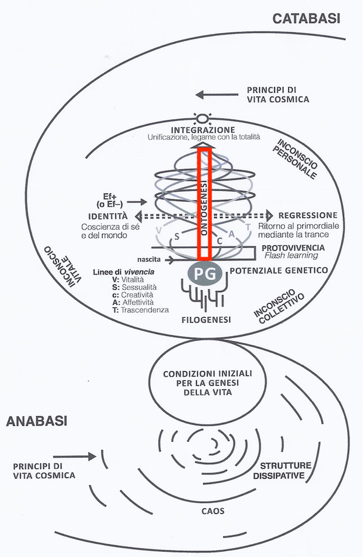

# Concluding Remarks: Ontogenesis in Biodanza

Ontogenesis is the vertical axis and can be seen as the time axis in the model, see Figure \@ref(fig:modelOnto2).

```{r modelOnto2, fig.cap='Model of Biodanza and Ontogenesis', out.width='50%', fig.asp=.8, fig.align='center', echo=FALSE}

```


Vivencia is the core instrument of the methodology of Biodanza, which has a strong impact on our body and brain. Indeed sensations that we experience are having a physiological impact through the genes that encode for a diverse scala of proteins, hormones and neurotransmitters. 

Similar to what was shown extensively for other body-mind techniques in well controlled experiments (see e.g. @BlackburnEpel2017), we can expect many health benefits when practicing Biodanza. Also note, that the effects described by @BlackburnEpel2017 for other body-mind techniques are in line with what Rolando Toro envisioned: going from reducing stress, preventing and reducing inflammation, to cell rejuvenation, etc.

Vivencia also has the quality that it immediately accesses our embodied mind through experience while bypassing our cognitive mind. So it enables us to learn by strong experiences that directly tap into our personal, collective and vital unconsciousness. 

The experiences through vivencia can be imprinted through the epigenetic mechanisms of learning and memory.  Indeed, as Biodanza practitioners we are familiar with the long lasting memories to a deep vivencia. Moreover, practicing Biodanza over a longer period also induces change.
Change in how we feel, stand in life, interact socially and with our environment. 
This change is undoubtedly a result of rewiring of our brain and thus of how we effectively use our genetic potential. 


Hence, with the methodology of Biodanza we have a very powerful tool to influence our ontogenesis: the pulsation between regression and identity in the five lines of Biodanza through the gestalt: music, movement and vivencia. 
This  pulsation between regression and identity is essential because an organism tends to filter stimuli that are continuously present. 

So in a typical Biodanza session,

- we first enhance our identity through vital exercises, 
- subsequently we slow down our movement and lower our state of control in exercises on regression and  transcendence, which deeply connect us with our personal, collective and vital unconsciousness  and promote strong vivencia. 
- Finally,  we stimulate our vivencia to be imprinted in our long term memory during the positive vibes in the reactivation and vital exercises at the end of the session. 

With the repetition of exercises across multiple sessions we effectively strengthen this imprinting further and eventually can promote immense personal growth and this in the five lines of Biodanza.

\newpage

# Postface {-}

This writing was my humble attempt to convey my passion for the system of Biodanza and vibrating it to you. I hope that I was able to 

- lay out the strong foundation of the System of Biodanza in the life sciences,
- link these biological aspects clearly to all relevant parts in the Model of Biodanza, and
- provide a better insight in these biological aspects for Biodanza practitioners and facilitators who do not have a formal training in the life sciences. 

I also hope that this monograph will trigger you to continue  with your Biodanza practice with even more enthusiasm. Indeed, it is a unique path to promote your ontogenesis and well-being, and, has the promise to impact your personal development considerably. Moreover, it might also change the larger autopoietic social system in which you are embedded. And this, as Rolando Toro envisioned, by effectively switching it to another attractor through its positive feedback on your change, growth and interaction.


