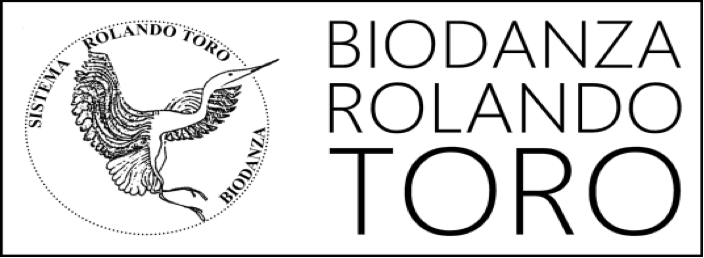

```{r include=FALSE}
# automatically create a bib database for R packages
knitr::write_bib(c(
  .packages(), 'bookdown', 'knitr', 'rmarkdown'
), 'packages.bib')

#bookdown::render_book("index.Rmd", "bookdown::gitbook")
#bookdown::render_book("index.Rmd", "bookdown::pdf_book")
```

<!--
```{asis, eval=(knitr::is_html_output())}
# {-}

```
-->
```{r, eval=knitr::is_html_output(excludes = "epub"), results = 'asis', echo = F}
cat('
# {-}
<center>

Biodanza School - Systema Rolando Toro - Antwerpen 

Director: Annette Heynderickx

Cycle VI

Monograph for the title of Biodanza Teacher

Lieven Clement

Supervisors: Annette Heynderickx & Nadia Costa
</center>
'
)
```


# Licence and links {.unnumbered}

This work is shared under the <a href= "https://creativecommons.org/licenses/by-nc-sa/4.0"> CC BY-NC-SA 4.0</a> licence on `r format(Sys.time(), "%d %B, %Y")`.

You may use the material for non-commercial purposes.

You are allowed to copy and redistribute the material in any medium or format and remix, transform, and build upon the material provided that you give proper credit to the author.

If you remix, transform, or build upon the material, you must distribute your contributions under the same license as the original.

The ebook can be found at [https://biodanzabrugge.be/biologicalAspectsBiodanza/](https://biodanzabrugge.be/biologicalAspectsBiodanza/)

A pdf version of this ebook can be found here: [Biological-Aspects-of-Biodanza.pdf](https://biodanzabrugge.be/biologicalAspectsBiodanza/Biological-Aspects-of-Biodanza.pdf)

Een nederlandstalige versie van het ebook vind je via deze link (A Dutch version of the ebook is available at): [https://biodanzabrugge.be/biologischeAspectenBiodanza](https://biodanzabrugge.be/biologischeAspectenBiodanza)

<!-- 
An epub version of this ebook can be found here: 
[Biological-Aspects-of-Biodanza.epub](https://biodanzabrugge.be/biologicalAspectsBiodanza/Biological-Aspects-of-Biodanza.epub)
-->

\mainmatter

# Acknowledgements {-}

My path to this monograph is a path of a lifetime.  
Everything I have in me came together. 

I grew up in a warm nest where music vibrated through the house.  
A nest where I was also encouraged to think and to articulate my daydreams.   
A nest that gave me the space to develop a passion for science.

When I turned eighteen, I had to choose between music or science.   
It became science.   
A path that eventually led me to my passion in statistical genomics, a branch of statistics that allows us to learn from massive datasets how genes are expressed differently due to internal and external stimuli, ecofactors, disease, our genetic potential, etc.   
This turned out to be a crucial component for my understanding of the Biodanza model.

On that scientific path music had faded to the background,  
I slowly became more intertwined with my mind, and    
my passion became somewhat mechanical due to the Cartesian thinking that is so prevalent in the academic world.  

But fortunately, I am together with Fien.  
Fien who, like a beacon,  always brought me back to the here and now.  
Fien who showed me again and again that life is so much more.   
Fien who introduced me to fatherhood and blessed me with three sons.

Fien,  
it was you who ultimately brought Biodanza into our lives,   
so that knowing again could turn into feeling,   
and that my head and heart could coalesce once more.

Biodanza that brings out the best in both of us,  
that transforms our togetherness into what Rolando would call ecological couplehood,  
because it forges our strengths into a shared passion,  
into a new way of life.

And your path also brought Annette & Frank into my life.  
First through your stories about the Biodanza teacher training,  
then by taking me to their Biodanza Workshops in the French Ardennes,  
and ultimately by fully supporting me to start in the new cycle of the teacher training.  

A path that radically transformed me.  
Music, movement, dance, passion, science, body, mind,   
it all came together again and became one.  

Annette & Frank,   
you showed me how everything stems from intensely experiencing life, here and now.  
Vivencia,  
that started to transform me,  
and that's an art that you, Annette, understand like no other^[Echos of some of these vivencia can be found in the addendum of this monograph].  

In addition to the deepening vivencia,   
you also stimulated me by exposing me to the many scientific concepts underpinning Biodanza.  
These reignited my passion for science.

And then you did something incredible...   
With your immense confidence,  
you invited me to co-present the theory of the Biological Aspects of Biodanza in the teacher training,  
which accelerated my transformation tremendously,  
and culminated one year later in the first rough version of this monograph.

A version that I shared with Annemie and Frederieke,  
while thinking back,   
I blush lightly.  
But your feedback was essential to convey my message towards Biodanza teachers and enthousiasts.

And Annette,  
six months later,   
with a novel masterstroke,  
you amplified my momentum even more.  
There at your little caravan in the South of France,  
just before the start of the extension "the path of ecstasy",   
you invited me and Fien to sit together with Nadia,   
one of the most inspiring people we've ever met...  
And you asked her to guide my monograph.  


Nadia,   
during that extension,   
I hung on your every word...  
You speak the language of the heart,   
that of life,   
with such simplicity and depth.   
And between the lines,   
I could recognized the flavor of scientific discourse.  
And on top of that...   
came the phenomenal expression in your movement...  
So inspiring!  

In the months that followed,  
with so much patience and passion,  
you took me on a journey through my monograph.  
With razor-sharp precision  
you dissected it,  
deepened it,  
and brought it even more to life.  

Every Zoom call was so transformative...  
Rarely have I been so awake, alert, and lucid.  
Every word mattered...  
And each time there was yet another sentence that continued to resonate for days and formed the basis of an entirely new call.  

You gave me so much insight and confidence.  
You encouraged me to explore,  
to deeply feel the theory of the biological aspects, and  
to connect it with the Biodanza methodology.

And then you gave me your blessing to send my monograph into the world,  
but not without one last nod to the richness of Rolando's system:  
"Et maintenant,  
tu peux faire la même chose pour  
les aspects fysiologiques,  
les aspects psychologiques,  
les prédécesseurs mythiques et philosophiques,   
..."  

At last, I would like to thank everyone with whom I have had the privilege to dance.
Particularly, the people from the teacher training, and from our Monday and Wednesday group in Bruges.  
Our dances have shaped me,    
and through you I could discover the beauty in my path as Biodanza teacher that lies ahead...


-- February 2024 -- 


# Summary {-}

I started the Biodanza teacher training in the School of Antwerp in 2021. Its enriched environment changed my views on life and how I experience life, entirely. It  triggered a tremendous personal growth and stimulated me to reconnect my mind, body and hart. 

From the first module of the teacher training, I was startled to see that the vertical axis in the model of Biodanza appeared to be so closely intertwined with my scientific path in the last 25 years. Indeed, Rolondo Toro had been inspired by so many leading scientists while developing his System of Biodanza. However, in my formal scientific education, I had never been exposed to many of the concepts that were touched upon in the first modules of the teacher training, and I could not comprehend these without consulting the work of the original authors. 

My monograph, therefore, reflects my quest to understand Rolando's view on the biological aspects, which he enfolded in his model of Biodanza. In the first chapter, I introduce the model of Biodanza to put all readers on the same footprint. In the second chapter, I  try to shed light on Rolando's view on life, his biocentric principle and vital unconsciousness. In this chapter I also lay the foundations for the remaining three chapters that each focus on an important biological aspect in the model of Biodanza: (1) Principles of cosmic life and the genesis of life, for which I give a short narrative on the history of the universe up to the origin of life, (2) Phylogenesis and evolution, in which I tells a brief story on the history of life and how life evolved, and, (3) Ontogenesis, where I shed some light on how we evolve from our origin as a fertilized egg cell up to our adult stage until we eventually die. In the latter chapter there is a strong focus on epigenetics, which is the missing link that Rolando Toro needed to explain how Biodanza can provide an enriched environment that induces change in how we use our genetic potential. Finally, I end this monograph with some concluding remarks and with an addendum with some additional texts and impressions that I have written during my Biodanza teacher training. 

